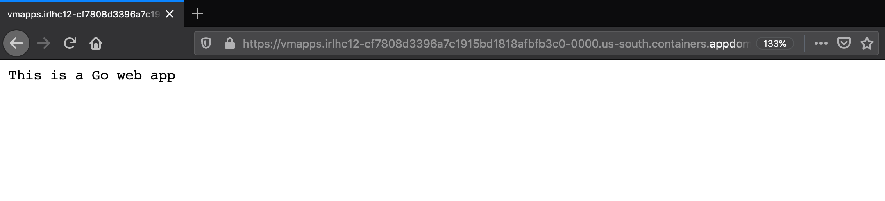
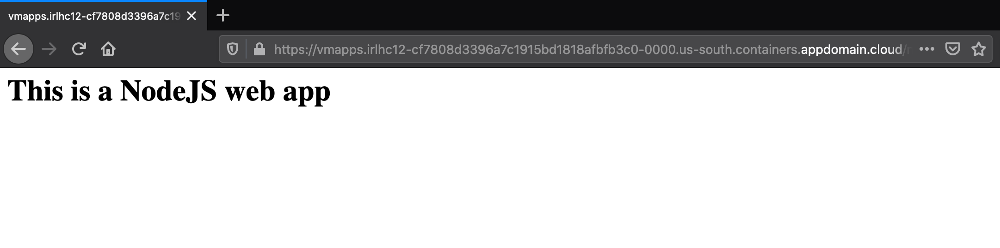
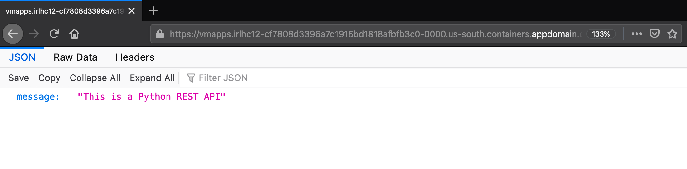
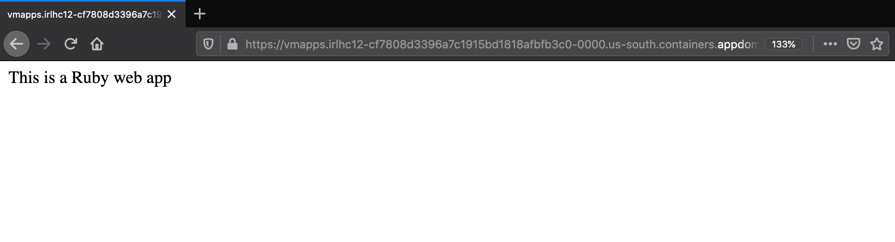
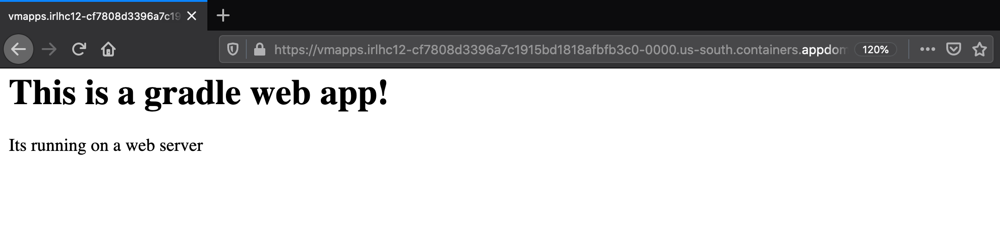
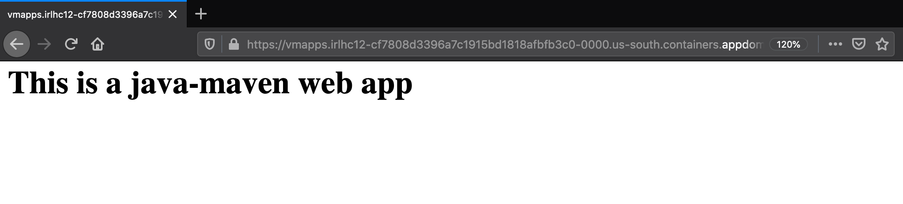

# Using Move2Kube CLI

## Description

In this tutorial we will see how we can transform a set of sample applications to run on Kubernetes. We will use the Move2Kube CLI tool to generate the Kubernetes yamls, Dockerfiles and build scripts for each application. We will then build the container images and deploy them to a cluster.

## Prerequisites

1. Install the [Move2Kube CLI tool](https://move2kube.konveyor.io/installation/cli/)

1. Download [language-platforms.zip](https://github.com/konveyor/move2kube-demos/raw/main/samples/language-platforms.zip) which we will be using for this tutorial. The language-platforms.zip file has a combination of multiple applications in different languages (Java, Go, Python, Ruby, etc.) which needs to be containerized and then put into Kubernetes.

## Steps to use the CLI to do a transformation

1. Unzip the `language-platforms.zip` file that we downloaded. We can see there are several directories. Each directory contains a simple web application written in different languages.
    ```console
    $ unzip language-platforms.zip 
    Archive:  language-platforms.zip
    creating: language-platforms/
    creating: language-platforms/ruby/
    inflating: language-platforms/ruby/config.ru  
    creating: language-platforms/ruby/views/
    inflating: language-platforms/ruby/views/main.erb  
    inflating: language-platforms/ruby/Gemfile  
    inflating: language-platforms/ruby/app.rb  
    creating: language-platforms/java-maven-war/
    inflating: language-platforms/java-maven-war/java-maven-war.war  
    creating: language-platforms/php/
    creating: language-platforms/php/php/
    inflating: language-platforms/php/php/index.php  
    creating: language-platforms/nodejs/
    inflating: language-platforms/nodejs/package.json  
    inflating: language-platforms/nodejs/main.js  
    creating: language-platforms/java-maven/
    creating: language-platforms/java-maven/src/
    creating: language-platforms/java-maven/src/main/
    creating: language-platforms/java-maven/src/main/webapp/
    creating: language-platforms/java-maven/src/main/webapp/WEB-INF/
    inflating: language-platforms/java-maven/src/main/webapp/WEB-INF/web.xml  
    inflating: language-platforms/java-maven/src/main/webapp/index.jsp  
    inflating: language-platforms/java-maven/pom.xml  
    creating: language-platforms/java-gradle/
    creating: language-platforms/java-gradle/src/
    creating: language-platforms/java-gradle/src/main/
    creating: language-platforms/java-gradle/src/main/java/
    creating: language-platforms/java-gradle/src/main/java/simplewebapp/
    inflating: language-platforms/java-gradle/src/main/java/simplewebapp/MainServlet.java  
    creating: language-platforms/java-gradle/src/main/webapp/
    creating: language-platforms/java-gradle/src/main/webapp/WEB-INF/
    inflating: language-platforms/java-gradle/src/main/webapp/WEB-INF/web.xml  
    inflating: language-platforms/java-gradle/build.gradle  
    creating: language-platforms/python/
    inflating: language-platforms/python/main.py  
    inflating: language-platforms/python/requirements.txt  
    creating: language-platforms/java-gradle-war/
    inflating: language-platforms/java-gradle-war/java-gradle-war.war  
    creating: language-platforms/golang/
    inflating: language-platforms/golang/main.go  
    extracting: language-platforms/.m2kignore  
    $ ls language-platforms
    golang		java-gradle	java-gradle-war	java-maven	java-maven-war	nodejs		php		python		ruby
    ```

1. Run `move2kube plan -s language-platforms` to generate a plan file. The `-s` flag is used to specify a source directory. Here we give `language-platforms` because we want
Move2Kube to analyze the sourcd code inside the `language-platforms` directory and come up with a plan for transforming them to Kubernetes YAMLs.
    ```console
    $ move2kube plan -s language-platforms
    INFO[0000] Loading Configuration                        
    INFO[0000] [*configuration.ClusterMDLoader] Loading configuration 
    INFO[0000] [*configuration.ClusterMDLoader] Done        
    INFO[0000] Configuration loading done                   
    INFO[0000] Planning Transformation - Base Directory     
    INFO[0000] [DockerfileDetector] Planning transformation 
    INFO[0000] [DockerfileDetector] Done                    
    INFO[0000] [ZuulAnalyser] Planning transformation       
    INFO[0000] [ZuulAnalyser] Done                          
    INFO[0000] [CloudFoundry] Planning transformation       
    INFO[0000] [CloudFoundry] Done                          
    INFO[0000] [ComposeAnalyser] Planning transformation    
    INFO[0000] [ComposeAnalyser] Done                       
    INFO[0000] [Base Directory] Identified 0 namedservices and 0 unnamed transformer plans 
    INFO[0000] Transformation planning - Base Directory done 
    INFO[0000] Planning Transformation - Directory Walk     
    INFO[0000] Identified 1 namedservices and 0 unnamed transformer plans in java-gradle-war 
    INFO[0000] Identified 1 namedservices and 0 unnamed transformer plans in java-maven 
    INFO[0000] Identified 1 namedservices and 0 unnamed transformer plans in java-maven-war 
    INFO[0000] Identified 1 namedservices and 0 unnamed transformer plans in nodejs 
    INFO[0000] Identified 1 namedservices and 0 unnamed transformer plans in php/php 
    INFO[0000] Identified 1 namedservices and 0 unnamed transformer plans in python 
    INFO[0000] Identified 1 namedservices and 0 unnamed transformer plans in ruby 
    INFO[0000] Transformation planning - Directory Walk done 
    INFO[0000] [Directory Walk] Identified 4 namedservices and 3 unnamed transformer plans 
    INFO[0000] [Named Services] Identified 7 namedservices  
    INFO[0000] No of services identified : 7                
    INFO[0000] Plan can be found at [/Users/user/Desktop/temp/m2k.plan].
    ```

1. Now let's look at the plan file we generated. The plan is in YAML format. We see that Move2Kube has detected all the different services, one for each web app.

    ```console
    $ ls
    language-platforms	language-platforms.zip	m2k.plan
    $ cat m2k.plan 
    ```

    ```yaml
    apiVersion: move2kube.konveyor.io/v1alpha1
    kind: Plan
    metadata:
        name: myproject
    spec:
        rootDir: language-platforms
        services:
            app:
                - artifact: Ruby-Dockerfile
                    paths:
                    ProjectPath:
                        - ruby
            main:
                - artifact: Nodejs-Dockerfile
                    paths:
                    ProjectPath:
                        - nodejs
            myproject-java-gradle-war:
                - artifact: WarAnalyser
                    paths:
                    ProjectPath:
                        - java-gradle-war
                    War:
                        - java-gradle-war/java-gradle-war.war
                    configs:
                    War:
                        deploymentFile: java-gradle-war.war
                        javaVersion: ""
                        buildContainerName: ""
                        deploymentFileDirInBuildContainer: ""
                        envVariables: {}
            myproject-java-maven-war:
                - artifact: WarAnalyser
                    paths:
                    ProjectPath:
                        - java-maven-war
                    War:
                        - java-maven-war/java-maven-war.war
                    configs:
                    War:
                        deploymentFile: java-maven-war.war
                        javaVersion: ""
                        buildContainerName: ""
                        deploymentFileDirInBuildContainer: ""
                        envVariables: {}
            myproject-php:
                - artifact: PHP-Dockerfile
                    paths:
                    ProjectPath:
                        - php/php
            myproject-python:
                - artifact: Python-Dockerfile
                    paths:
                    MainPythonFilesPathType: []
                    ProjectPath:
                        - python
                    PythonFilesPathType:
                        - python/main.py
                    RequirementsTxtPathType:
                        - python/requirements.txt
                    configs:
                    PythonConfig:
                        IsDjangoProject: false
            simplewebapp:
                - artifact: Maven
                    paths:
                    MavenPom:
                        - java-maven/pom.xml
                    ProjectPath:
                        - java-maven
                    configs:
                    Maven:
                        mavenAppName: simplewebapp
                        artifactType: war
        targetCluster:
            type: Kubernetes
        configuration:
            transformers:
            Buildconfig: m2kassets/inbuilt/transformers/kubernetes/buildconfig/buildconfig.yaml
            CloudFoundry: m2kassets/inbuilt/transformers/cloudfoundry/cloudfoundry.yaml
            ComposeAnalyser: m2kassets/inbuilt/transformers/compose/composeanalyser/composeanalyser.yaml
            ComposeGenerator: m2kassets/inbuilt/transformers/compose/composegenerator/composegenerator.yaml
            ContainerImagesBuildScriptGenerator: m2kassets/inbuilt/transformers/containerimage/containerimagesbuildscript/containerimagesbuildscript.yaml
            ContainerImagesPushScriptGenerator: m2kassets/inbuilt/transformers/containerimage/containerimagespushscript/containerimagespushscript.yaml
            DockerfileDetector: m2kassets/inbuilt/transformers/dockerfile/dockerfiledetector/dockerfiledetector.yaml
            DockerfileImageBuildScript: m2kassets/inbuilt/transformers/dockerfile/dockerimagebuildscript/dockerfilebuildscriptgenerator.yaml
            DockerfileParser: m2kassets/inbuilt/transformers/dockerfile/dockerfileparser/dockerfileparser.yaml
            DotNetCore-Dockerfile: m2kassets/inbuilt/transformers/dockerfilegenerator/dotnetcore/dotnetcore.yaml
            EarAnalyser: m2kassets/inbuilt/transformers/dockerfilegenerator/java/earanalyser/ear.yaml
            EarRouter: m2kassets/inbuilt/transformers/dockerfilegenerator/java/earrouter/earrouter.yaml
            EurekaReplaceEngine: m2kassets/inbuilt/transformers/dockerfilegenerator/java/eurekareplaceengine/eureka.yaml
            Golang-Dockerfile: m2kassets/inbuilt/transformers/dockerfilegenerator/golang/golang.yaml
            Jar: m2kassets/inbuilt/transformers/dockerfilegenerator/java/jar/jar.yaml
            Jboss: m2kassets/inbuilt/transformers/dockerfilegenerator/java/jboss/jboss.yaml
            Knative: m2kassets/inbuilt/transformers/kubernetes/knative/knative.yaml
            Kubernetes: m2kassets/inbuilt/transformers/kubernetes/kubernetes/kubernetes.yaml
            Liberty: m2kassets/inbuilt/transformers/dockerfilegenerator/java/liberty/liberty.yaml
            Maven: m2kassets/inbuilt/transformers/dockerfilegenerator/java/maven/maven.yaml
            Nodejs-Dockerfile: m2kassets/inbuilt/transformers/dockerfilegenerator/nodejs/nodejs.yaml
            PHP-Dockerfile: m2kassets/inbuilt/transformers/dockerfilegenerator/php/php.yaml
            Parameterizer: m2kassets/inbuilt/transformers/kubernetes/parameterizers/parameterizers.yaml
            Python-Dockerfile: m2kassets/inbuilt/transformers/dockerfilegenerator/python/python.yaml
            ReadMeGenerator: m2kassets/inbuilt/transformers/readmegenerator/readmegenerator.yaml
            Ruby-Dockerfile: m2kassets/inbuilt/transformers/dockerfilegenerator/ruby/ruby.yaml
            Rust: m2kassets/inbuilt/transformers/dockerfilegenerator/rust/rust.yaml
            Tekton: m2kassets/inbuilt/transformers/kubernetes/tekton/tekton.yaml
            Tomcat: m2kassets/inbuilt/transformers/dockerfilegenerator/java/tomcat/tomcat.yaml
            WarAnalyser: m2kassets/inbuilt/transformers/dockerfilegenerator/java/waranalyser/war.yaml
            WarRouter: m2kassets/inbuilt/transformers/dockerfilegenerator/java/warrouter/warrouter.yaml
            WinConsoleApp-Dockerfile: m2kassets/inbuilt/transformers/dockerfilegenerator/windows/winconsole/winconsole.yaml
            WinSLWebApp-Dockerfile: m2kassets/inbuilt/transformers/dockerfilegenerator/windows/winsilverlightweb/winsilverlightweb.yaml
            WinWebApp-Dockerfile: m2kassets/inbuilt/transformers/dockerfilegenerator/windows/winweb/winweb.yaml
            ZuulAnalyser: m2kassets/inbuilt/transformers/dockerfilegenerator/java/zuul/zuulanalyser.yaml
            targetClusters:
            Kubernetes: m2kassets/inbuilt/clusters/kubernetes.yaml
            Openshift: m2kassets/inbuilt/clusters/openshift.yaml
    ```

1. Now let's run the transformation using `move2kube transform`. This will do the transformation according to the plan we generated. By default Move2Kube looks for a plan file in the current directory. If you want to specify the path to a different plan file you can do so using the `-p` flag. During transformation Move2Kube will ask us several questions to help guide the transformation process.
    
    For the question about container registry, specify the container registry where you want to push the images.
    ```console
    ? Enter the URL of the image registry : 
    Hints:
    [You can always change it later by changing the yamls.]
    us.icr.io
    ```
    Same for the question about container registry namespace.
    ```console
    ? Enter the namespace where the new images should be pushed : 
    Hints:
    [Ex : myproject]
    m2k-tutorial
    ```
    If your container registry requires authentication for pulling images, then specify that in the question about container registry login.
    ```console
    ? [quay.io] What type of container registry login do you want to use?
    Hints:
    [Docker login from config mode, will use the default config from your local machine.]
    No authentication
    ```
    For the question about ingress host, specify the hostname of the Kubernetes cluster. If you are deploying to Minikube then specify `localhost` as the hostname and leave the TLS secret blank.
    ```console
    ? Provide the ingress host domain
    Hints:
    [Ingress host domain is part of service URL]
    localhost
    ? Provide the TLS secret for ingress
    Hints:
    [Leave empty to use http]

    ```

    For all other questions we will go with the default answers by pressing `Enter` for each question.
    ```console
    $ move2kube transform
    INFO[0000] Detected a plan file at path /Users/user/Desktop/temp/m2k.plan. Will transform using this plan. 
    ? Select all transformer types that you are interested in:
    Hints:
    [Services that don't support any of the transformer types you are interested in will be ignored.]
    WarRouter, WinConsoleApp-Dockerfile, WinSLWebApp-Dockerfile, WinWebApp-Dockerfile, ComposeGenerator, DockerfileDetector, Buildconfig, WarAnalyser, Rust, Tomcat, CloudFoundry, Jar, ReadMeGenerator, Tekton, DotNetCore-Dockerfile, Golang-Dockerfile, DockerfileParser, Maven, Python-Dockerfile, ZuulAnalyser, ComposeAnalyser, DockerfileImageBuildScript, EurekaReplaceEngine, Jboss, Liberty, Nodejs-Dockerfile, Parameterizer, EarAnalyser, EarRouter, Knative, Kubernetes, PHP-Dockerfile, Ruby-Dockerfile, ContainerImagesBuildScriptGenerator, ContainerImagesPushScriptGenerator
    ? Select all services that are needed:
    Hints:
    [The services unselected here will be ignored.]
    myproject-python, simplewebapp, app, main, myproject-java-gradle-war, myproject-java-maven-war, myproject-php
    ? Choose the cluster type:
    Hints:
    [Choose the cluster type you would like to target]
    Kubernetes
    INFO[0009] Starting Plan Transformation                 
    INFO[0009] Iteration 1                                  
    INFO[0009] Iteration 2                                  
    INFO[0009] Transformer Python-Dockerfile processing 1 artifacts 
    ? Select port to be exposed for the service myproject-python :
    Hints:
    [Select Other if you want to expose the service myproject-python to some other port]
    8080
    INFO[0011] Created 2 pathMappings and 2 artifacts. Total Path Mappings : 2. Total Artifacts : 7. 
    INFO[0011] Transformer Python-Dockerfile Done           
    INFO[0011] Transformer Nodejs-Dockerfile processing 1 artifacts 
    ? Enter the port to be exposed for the service main: 
    Hints:
    [The service main will be exposed to the specified port]
    8080
    INFO[0012] Created 2 pathMappings and 2 artifacts. Total Path Mappings : 4. Total Artifacts : 7. 
    INFO[0012] Transformer Nodejs-Dockerfile Done           
    INFO[0012] Transformer WarAnalyser processing 2 artifacts 
    INFO[0012] Created 0 pathMappings and 2 artifacts. Total Path Mappings : 4. Total Artifacts : 7. 
    INFO[0012] Transformer WarAnalyser Done                 
    INFO[0012] Transformer Maven processing 1 artifacts     
    INFO[0012] Created 1 pathMappings and 1 artifacts. Total Path Mappings : 5. Total Artifacts : 7. 
    INFO[0012] Transformer Maven Done                       
    INFO[0012] Transformer PHP-Dockerfile processing 1 artifacts 
    ? Enter the port to be exposed for the service myproject-php: 
    Hints:
    [The service myproject-php will be exposed to the specified port]
    8080
    INFO[0012] Created 2 pathMappings and 2 artifacts. Total Path Mappings : 7. Total Artifacts : 7. 
    INFO[0012] Transformer PHP-Dockerfile Done              
    INFO[0012] Transformer Ruby-Dockerfile processing 1 artifacts 
    ? Select port to be exposed for the service app :
    Hints:
    [Select Other if you want to expose the service app to some other port]
    8080
    INFO[0013] Created 2 pathMappings and 2 artifacts. Total Path Mappings : 9. Total Artifacts : 7. 
    INFO[0013] Transformer Ruby-Dockerfile Done             
    INFO[0013] Iteration 3                                  
    INFO[0013] Transformer DockerfileImageBuildScript processing 5 artifacts 
    INFO[0013] Created 1 pathMappings and 5 artifacts. Total Path Mappings : 10. Total Artifacts : 18. 
    INFO[0013] Transformer DockerfileImageBuildScript Done  
    INFO[0013] Transformer DockerfileParser processing 4 artifacts 
    INFO[0013] Created 0 pathMappings and 4 artifacts. Total Path Mappings : 10. Total Artifacts : 18. 
    INFO[0013] Transformer DockerfileParser Done            
    INFO[0013] Transformer WarRouter processing 4 artifacts 
    ? Select the transformer to use for service myproject-java-gradle-war
    Jboss
    ? Select the transformer to use for service myproject-java-maven-war
    Jboss
    ? Select the transformer to use for service simplewebapp
    Jboss
    INFO[0015] Created 0 pathMappings and 4 artifacts. Total Path Mappings : 10. Total Artifacts : 18. 
    INFO[0015] Transformer WarRouter Done                   
    INFO[0015] Iteration 4                                  
    INFO[0015] Transformer ComposeGenerator processing 2 artifacts 
    INFO[0015] Begin Optimization                           
    ? What URL/path should we expose the service main's 8080 port on?
    Hints:
    [Enter :- not expose the service, Leave out leading / to use first part as subdomain, Add :N as suffix for NodePort service type, Add :L for Load Balancer service type]
    /main
    ? What URL/path should we expose the service myproject-php's 8080 port on?
    Hints:
    [Enter :- not expose the service, Leave out leading / to use first part as subdomain, Add :N as suffix for NodePort service type, Add :L for Load Balancer service type]
    /myproject-php
    ? What URL/path should we expose the service app's 8080 port on?
    Hints:
    [Enter :- not expose the service, Leave out leading / to use first part as subdomain, Add :N as suffix for NodePort service type, Add :L for Load Balancer service type]
    /app
    ? What URL/path should we expose the service myproject-python's 8080 port on?
    Hints:
    [Enter :- not expose the service, Leave out leading / to use first part as subdomain, Add :N as suffix for NodePort service type, Add :L for Load Balancer service type]
    /myproject-python
    ? Provide the minimum number of replicas each service should have
    Hints:
    [If the value is 0 pods won't be started by default]
    2
    ? Enter the URL of the image registry : 
    Hints:
    [You can always change it later by changing the yamls.]
    us.icr.io
    ? Enter the namespace where the new images should be pushed : 
    Hints:
    [Ex : myproject]
    m2k-tutorial
    ? [quay.io] What type of container registry login do you want to use?
    Hints:
    [Docker login from config mode, will use the default config from your local machine.]
    No authentication
    INFO[0020] Optimization done                            
    INFO[0020] Begin Optimization                           
    INFO[0020] Optimization done                            
    INFO[0020] Created 2 pathMappings and 0 artifacts. Total Path Mappings : 12. Total Artifacts : 31. 
    INFO[0020] Transformer ComposeGenerator Done            
    INFO[0020] Transformer Buildconfig processing 2 artifacts 
    INFO[0020] Begin Optimization                           
    INFO[0020] Optimization done                            
    INFO[0020] Created 0 pathMappings and 0 artifacts. Total Path Mappings : 12. Total Artifacts : 31. 
    INFO[0020] Transformer Buildconfig Done                 
    INFO[0020] Transformer Jboss processing 4 artifacts     
    INFO[0020] Created 8 pathMappings and 8 artifacts. Total Path Mappings : 20. Total Artifacts : 31. 
    INFO[0020] Transformer Jboss Done                       
    INFO[0020] Transformer Tekton processing 2 artifacts    
    INFO[0020] Begin Optimization                           
    INFO[0020] Optimization done                            
    INFO[0020] Generating Tekton pipeline for CI/CD         
    INFO[0020] No remote git repos detected. You might want to configure the git repository links manually. 
    ? Provide the ingress host domain
    Hints:
    [Ingress host domain is part of service URL]
    localhost
    ? Provide the TLS secret for ingress
    Hints:
    [Leave empty to use http]
    
    INFO[0022] Begin Optimization                           
    INFO[0022] Optimization done                            
    INFO[0022] Generating Tekton pipeline for CI/CD         
    INFO[0022] No remote git repos detected. You might want to configure the git repository links manually. 
    INFO[0022] Created 20 pathMappings and 2 artifacts. Total Path Mappings : 40. Total Artifacts : 31. 
    INFO[0022] Transformer Tekton Done                      
    INFO[0022] Transformer ContainerImagesPushScriptGenerator processing 2 artifacts 
    INFO[0022] Created 1 pathMappings and 1 artifacts. Total Path Mappings : 41. Total Artifacts : 31. 
    INFO[0022] Transformer ContainerImagesPushScriptGenerator Done 
    INFO[0022] Transformer Kubernetes processing 2 artifacts 
    INFO[0022] Begin Optimization                           
    INFO[0022] Optimization done                            
    INFO[0022] Total transformed objects : 9                
    INFO[0022] Begin Optimization                           
    INFO[0022] Optimization done                            
    INFO[0022] Total transformed objects : 9                
    INFO[0022] Created 2 pathMappings and 2 artifacts. Total Path Mappings : 43. Total Artifacts : 31. 
    INFO[0022] Transformer Kubernetes Done                  
    INFO[0022] Transformer Knative processing 2 artifacts   
    INFO[0022] Begin Optimization                           
    INFO[0022] Optimization done                            
    INFO[0022] Begin Optimization                           
    INFO[0022] Optimization done                            
    INFO[0022] Created 8 pathMappings and 2 artifacts. Total Path Mappings : 51. Total Artifacts : 31. 
    INFO[0022] Transformer Knative Done                     
    INFO[0022] Transformer ContainerImagesBuildScriptGenerator processing 2 artifacts 
    INFO[0022] Created 2 pathMappings and 1 artifacts. Total Path Mappings : 53. Total Artifacts : 31. 
    INFO[0022] Transformer ContainerImagesBuildScriptGenerator Done 
    INFO[0022] Iteration 5                                  
    INFO[0022] Transformer Parameterizer processing 4 artifacts 
    INFO[0022] Created 12 pathMappings and 0 artifacts. Total Path Mappings : 65. Total Artifacts : 47. 
    INFO[0022] Transformer Parameterizer Done               
    INFO[0022] Transformer DockerfileImageBuildScript processing 4 artifacts 
    INFO[0023] Created 1 pathMappings and 8 artifacts. Total Path Mappings : 66. Total Artifacts : 47. 
    INFO[0023] Transformer DockerfileImageBuildScript Done  
    INFO[0023] Transformer DockerfileParser processing 4 artifacts 
    INFO[0023] Created 0 pathMappings and 3 artifacts. Total Path Mappings : 66. Total Artifacts : 47. 
    INFO[0023] Transformer DockerfileParser Done            
    INFO[0023] Transformer ReadMeGenerator processing 6 artifacts 
    INFO[0023] Created 1 pathMappings and 0 artifacts. Total Path Mappings : 67. Total Artifacts : 47. 
    INFO[0023] Transformer ReadMeGenerator Done             
    INFO[0023] Iteration 6                                  
    INFO[0023] Transformer Kubernetes processing 2 artifacts 
    INFO[0023] Begin Optimization                           
    ? What URL/path should we expose the service simplewebapp's 9080 port on?
    Hints:
    [Enter :- not expose the service, Leave out leading / to use first part as subdomain, Add :N as suffix for NodePort service type, Add :L for Load Balancer service type]
    /simplewebapp
    ? What URL/path should we expose the service myproject-java-maven-war's 9080 port on?
    Hints:
    [Enter :- not expose the service, Leave out leading / to use first part as subdomain, Add :N as suffix for NodePort service type, Add :L for Load Balancer service type]
    /myproject-java-maven-war
    ? What URL/path should we expose the service myproject-java-gradle-war's 9080 port on?
    Hints:
    [Enter :- not expose the service, Leave out leading / to use first part as subdomain, Add :N as suffix for NodePort service type, Add :L for Load Balancer service type]
    /myproject-java-gradle-war
    INFO[0025] Optimization done                            
    INFO[0025] Total transformed objects : 15               
    INFO[0025] Begin Optimization                           
    INFO[0025] Optimization done                            
    INFO[0025] Total transformed objects : 15               
    INFO[0025] Created 2 pathMappings and 2 artifacts. Total Path Mappings : 69. Total Artifacts : 58. 
    INFO[0025] Transformer Kubernetes Done                  
    INFO[0025] Transformer Knative processing 2 artifacts   
    INFO[0025] Begin Optimization                           
    INFO[0025] Optimization done                            
    INFO[0025] Begin Optimization                           
    INFO[0025] Optimization done                            
    INFO[0025] Created 14 pathMappings and 2 artifacts. Total Path Mappings : 83. Total Artifacts : 58. 
    INFO[0025] Transformer Knative Done                     
    INFO[0025] Transformer ContainerImagesBuildScriptGenerator processing 2 artifacts 
    INFO[0025] Created 2 pathMappings and 1 artifacts. Total Path Mappings : 85. Total Artifacts : 58. 
    INFO[0025] Transformer ContainerImagesBuildScriptGenerator Done 
    INFO[0025] Transformer ComposeGenerator processing 2 artifacts 
    INFO[0026] Begin Optimization                           
    INFO[0026] Optimization done                            
    INFO[0026] Begin Optimization                           
    INFO[0026] Optimization done                            
    INFO[0026] Created 2 pathMappings and 0 artifacts. Total Path Mappings : 87. Total Artifacts : 58. 
    INFO[0026] Transformer ComposeGenerator Done            
    INFO[0026] Transformer Buildconfig processing 2 artifacts 
    INFO[0026] Begin Optimization                           
    INFO[0026] Optimization done                            
    INFO[0026] Created 0 pathMappings and 0 artifacts. Total Path Mappings : 87. Total Artifacts : 58. 
    INFO[0026] Transformer Buildconfig Done                 
    INFO[0026] Transformer Tekton processing 2 artifacts    
    INFO[0026] Begin Optimization                           
    INFO[0026] Optimization done                            
    INFO[0026] Generating Tekton pipeline for CI/CD         
    INFO[0026] No remote git repos detected. You might want to configure the git repository links manually. 
    INFO[0026] Begin Optimization                           
    INFO[0026] Optimization done                            
    INFO[0026] Generating Tekton pipeline for CI/CD         
    INFO[0026] No remote git repos detected. You might want to configure the git repository links manually. 
    INFO[0026] Created 20 pathMappings and 2 artifacts. Total Path Mappings : 107. Total Artifacts : 58. 
    INFO[0026] Transformer Tekton Done                      
    INFO[0026] Transformer ContainerImagesPushScriptGenerator processing 2 artifacts 
    INFO[0026] Created 1 pathMappings and 1 artifacts. Total Path Mappings : 108. Total Artifacts : 58. 
    INFO[0026] Transformer ContainerImagesPushScriptGenerator Done 
    INFO[0026] Iteration 7                                  
    INFO[0026] Transformer Parameterizer processing 4 artifacts 
    INFO[0026] Created 12 pathMappings and 0 artifacts. Total Path Mappings : 120. Total Artifacts : 66. 
    INFO[0026] Transformer Parameterizer Done               
    INFO[0026] Transformer ReadMeGenerator processing 6 artifacts 
    INFO[0026] Created 1 pathMappings and 0 artifacts. Total Path Mappings : 121. Total Artifacts : 66. 
    INFO[0026] Transformer ReadMeGenerator Done             
    INFO[0026] Plan Transformation done                     
    INFO[0026] Transformed target artifacts can be found at [/Users/user/Desktop/temp/myproject]. 
    ```

1. After the questions are finished wait a few minutes for it to finish processing. Once it's done, we can see it has generated a directory called `myproject`.
The name of the output directory is the same as the project name (by default `myproject`). The project name be changed using the `-n` flag.

    ```console
    $ ls
    language-platforms	language-platforms.zip	m2k.plan		m2kconfig.yaml		m2kqacache.yaml		myproject
    $ ls myproject/
    Readme.md	deploy		scripts		source
    ```

    The applications can now be deployed to Kubernetes using these generated artifacts.

## Deploying the application to Kubernetes with the generated artifacts

1. The full structure of the output directory can be seen by executing the `tree` command.

    ```console
    $ cd myproject/
    $ tree
    .
    ├── Readme.md
    ├── deploy
    │   ├── cicd
    │   │   ├── tekton
    │   │   │   ├── myproject-clone-build-push-pipeline.yaml
    │   │   │   ├── myproject-clone-push-serviceaccount.yaml
    │   │   │   ├── myproject-git-event-triggerbinding.yaml
    │   │   │   ├── myproject-git-repo-eventlistener.yaml
    │   │   │   ├── myproject-image-registry-secret.yaml
    │   │   │   ├── myproject-ingress.yaml
    │   │   │   ├── myproject-run-clone-build-push-triggertemplate.yaml
    │   │   │   ├── myproject-tekton-triggers-admin-role.yaml
    │   │   │   ├── myproject-tekton-triggers-admin-rolebinding.yaml
    │   │   │   └── myproject-tekton-triggers-admin-serviceaccount.yaml
    │   │   └── tekton-parameterized
    │   │       ├── helm-chart
    │   │       │   └── myproject
    │   │       │       ├── Chart.yaml
    │   │       │       └── templates
    │   │       │           ├── myproject-clone-build-push-pipeline.yaml
    │   │       │           ├── myproject-clone-push-serviceaccount.yaml
    │   │       │           ├── myproject-git-event-triggerbinding.yaml
    │   │       │           ├── myproject-git-repo-eventlistener.yaml
    │   │       │           ├── myproject-image-registry-secret.yaml
    │   │       │           ├── myproject-ingress.yaml
    │   │       │           ├── myproject-run-clone-build-push-triggertemplate.yaml
    │   │       │           ├── myproject-tekton-triggers-admin-role.yaml
    │   │       │           ├── myproject-tekton-triggers-admin-rolebinding.yaml
    │   │       │           └── myproject-tekton-triggers-admin-serviceaccount.yaml
    │   │       ├── kustomize
    │   │       │   └── base
    │   │       │       ├── kustomization.yaml
    │   │       │       ├── myproject-clone-build-push-pipeline.yaml
    │   │       │       ├── myproject-clone-push-serviceaccount.yaml
    │   │       │       ├── myproject-git-event-triggerbinding.yaml
    │   │       │       ├── myproject-git-repo-eventlistener.yaml
    │   │       │       ├── myproject-image-registry-secret.yaml
    │   │       │       ├── myproject-ingress.yaml
    │   │       │       ├── myproject-run-clone-build-push-triggertemplate.yaml
    │   │       │       ├── myproject-tekton-triggers-admin-role.yaml
    │   │       │       ├── myproject-tekton-triggers-admin-rolebinding.yaml
    │   │       │       └── myproject-tekton-triggers-admin-serviceaccount.yaml
    │   │       └── openshift-template
    │   │           └── template.yaml
    │   ├── compose
    │   │   └── docker-compose.yaml
    │   ├── knative
    │   │   ├── app-service.yaml
    │   │   ├── main-service.yaml
    │   │   ├── myproject-java-gradle-war-service.yaml
    │   │   ├── myproject-java-maven-war-service.yaml
    │   │   ├── myproject-php-service.yaml
    │   │   ├── myproject-python-service.yaml
    │   │   └── simplewebapp-service.yaml
    │   ├── knative-parameterized
    │   │   ├── helm-chart
    │   │   │   └── myproject
    │   │   │       ├── Chart.yaml
    │   │   │       └── templates
    │   │   │           ├── app-service.yaml
    │   │   │           ├── main-service.yaml
    │   │   │           ├── myproject-java-gradle-war-service.yaml
    │   │   │           ├── myproject-java-maven-war-service.yaml
    │   │   │           ├── myproject-php-service.yaml
    │   │   │           ├── myproject-python-service.yaml
    │   │   │           └── simplewebapp-service.yaml
    │   │   ├── kustomize
    │   │   │   └── base
    │   │   │       ├── app-service.yaml
    │   │   │       ├── kustomization.yaml
    │   │   │       ├── main-service.yaml
    │   │   │       ├── myproject-java-gradle-war-service.yaml
    │   │   │       ├── myproject-java-maven-war-service.yaml
    │   │   │       ├── myproject-php-service.yaml
    │   │   │       ├── myproject-python-service.yaml
    │   │   │       └── simplewebapp-service.yaml
    │   │   └── openshift-template
    │   │       └── template.yaml
    │   ├── yamls
    │   │   ├── app-deployment.yaml
    │   │   ├── app-service.yaml
    │   │   ├── main-deployment.yaml
    │   │   ├── main-service.yaml
    │   │   ├── myproject-ingress.yaml
    │   │   ├── myproject-java-gradle-war-deployment.yaml
    │   │   ├── myproject-java-gradle-war-service.yaml
    │   │   ├── myproject-java-maven-war-deployment.yaml
    │   │   ├── myproject-java-maven-war-service.yaml
    │   │   ├── myproject-php-deployment.yaml
    │   │   ├── myproject-php-service.yaml
    │   │   ├── myproject-python-deployment.yaml
    │   │   ├── myproject-python-service.yaml
    │   │   ├── simplewebapp-deployment.yaml
    │   │   └── simplewebapp-service.yaml
    │   └── yamls-parameterized
    │       ├── helm-chart
    │       │   └── myproject
    │       │       ├── Chart.yaml
    │       │       └── templates
    │       │           ├── app-deployment.yaml
    │       │           ├── app-service.yaml
    │       │           ├── main-deployment.yaml
    │       │           ├── main-service.yaml
    │       │           ├── myproject-ingress.yaml
    │       │           ├── myproject-java-gradle-war-deployment.yaml
    │       │           ├── myproject-java-gradle-war-service.yaml
    │       │           ├── myproject-java-maven-war-deployment.yaml
    │       │           ├── myproject-java-maven-war-service.yaml
    │       │           ├── myproject-php-deployment.yaml
    │       │           ├── myproject-php-service.yaml
    │       │           ├── myproject-python-deployment.yaml
    │       │           ├── myproject-python-service.yaml
    │       │           ├── simplewebapp-deployment.yaml
    │       │           └── simplewebapp-service.yaml
    │       ├── kustomize
    │       │   └── base
    │       │       ├── app-deployment.yaml
    │       │       ├── app-service.yaml
    │       │       ├── kustomization.yaml
    │       │       ├── main-deployment.yaml
    │       │       ├── main-service.yaml
    │       │       ├── myproject-ingress.yaml
    │       │       ├── myproject-java-gradle-war-deployment.yaml
    │       │       ├── myproject-java-gradle-war-service.yaml
    │       │       ├── myproject-java-maven-war-deployment.yaml
    │       │       ├── myproject-java-maven-war-service.yaml
    │       │       ├── myproject-php-deployment.yaml
    │       │       ├── myproject-php-service.yaml
    │       │       ├── myproject-python-deployment.yaml
    │       │       ├── myproject-python-service.yaml
    │       │       ├── simplewebapp-deployment.yaml
    │       │       └── simplewebapp-service.yaml
    │       └── openshift-template
    │           └── template.yaml
    ├── scripts
    │   ├── builddockerimages.bat
    │   ├── builddockerimages.sh
    │   ├── buildimages.bat
    │   ├── buildimages.sh
    │   ├── pushimages.bat
    │   └── pushimages.sh
    └── source
        ├── golang
        │   └── main.go
        ├── java-gradle
        │   ├── build.gradle
        │   └── src
        │       └── main
        │           ├── java
        │           │   └── simplewebapp
        │           │       └── MainServlet.java
        │           └── webapp
        │               └── WEB-INF
        │                   └── web.xml
        ├── java-gradle-war
        │   ├── Dockerfile
        │   └── java-gradle-war.war
        ├── java-maven
        │   ├── Dockerfile
        │   ├── pom.xml
        │   └── src
        │       └── main
        │           └── webapp
        │               ├── WEB-INF
        │               │   └── web.xml
        │               └── index.jsp
        ├── java-maven-war
        │   ├── Dockerfile
        │   └── java-maven-war.war
        ├── nodejs
        │   ├── Dockerfile
        │   ├── main.js
        │   └── package.json
        ├── php
        │   └── php
        │       ├── Dockerfile
        │       └── index.php
        ├── python
        │   ├── Dockerfile
        │   ├── main.py
        │   └── requirements.txt
        └── ruby
            ├── Dockerfile
            ├── Gemfile
            ├── app.rb
            ├── config.ru
            └── views
                └── main.erb

    50 directories, 138 files
    ```

    The CLI has created Kubernetes YAMLs for us which are stored inside the `deploy/yamls` directory. For each of the directories and the services identified, it has created the deployment artifacts, service artifacts and the ingress as required.  The `scripts` directory contains the scripts for building the images for the applications using Dockerfiles.

    Many scripts like `buildimages.sh` and `pushimages.sh` are also present inside the directory. It has also created a simple `deploy/compose/docker-compose.yaml` for you, so that you can test the images locally if you want. It has also created Tekton artifacts inside the `deploy/cicd/tekton` directory that are required if you want to use Tekton as your CI/CD pipeline.

    The `Readme.md` file guides on the next steps to be followed.

    ```console
    $ cat Readme.md
    Move2Kube
    ---------
    Congratulations! Move2Kube has generated the necessary build artfiacts for moving all your application components to Kubernetes. Using the artifacts in this directory you can deploy your application in a kubernetes cluster.

    Next Steps
    ----------
    To try locally use the scripts in the "./scripts" directory, to build, push and deploy. 

    For production usage use the CI/CD pipelines for deployment.
    ```

1. Next we run the `buildimages.sh` script. Make sure to run this from the `myproject` directory. This step may take some time to complete.

    ```console
    $ ./scripts/buildimages.sh
    ```

1. Now using the `pushimages.sh` script we can push our container images to the registry that we specified during the transformation. For this step we need to login into a container registry from the terminal. Instructions for:
    - [Quay https://docs.quay.io/solution/getting-started.html](https://docs.quay.io/solution/getting-started.html)
    - [Docker Hub https://docs.docker.com/engine/reference/commandline/login/](https://docs.docker.com/engine/reference/commandline/login/)

    After we login, we can push the images.
    ```console
    $ ./scripts/pushimages.sh
    ```

1. Finally we can deploy the applications using `kubectl apply -f ./deploy/yamls`

   ```console
   $ kubectl apply -f ./deploy/yamls
    deployment.apps/golang created
    service/golang created
    deployment.apps/myproject-django created
    service/myproject-django created
    ingress.networking.k8s.io/myproject created
    deployment.apps/myproject-php created
    service/myproject-php created
    deployment.apps/myproject-python created
    service/myproject-python created
    deployment.apps/nodejs created
    service/nodejs created
    deployment.apps/ruby created
    service/ruby created
    deployment.apps/rust created
    service/rust created
    ...
   ```

Now all our applications are accessible on the cluster. We can get the ingress to see the URLs where
the apps have been deployed to `kubectl get ingress myproject -o yaml`.
If you deployed to Minikube the apps should be available on the URLs given below:

* golang - [http://localhost/golang](http://localhost/golang)

   

* nodejs - [http://localhost/nodejs](http://localhost/nodejs)

   

* python - [http://localhost/myproject-python](http://localhost/myproject-python)

   

* ruby - [http://localhost/ruby](http://localhost/ruby)

   

* java-gradle - [http://localhost/java-gradle](http://localhost/java-gradle)

  

* java-maven - [http://localhost/java-maven](http://localhost/java-maven)

   

and so on ...

## Conclusion

So you can have a very diverse source environment, like the [language-platforms](https://github.com/konveyor/move2kube-demos/tree/main/samples/language-platforms) sample which has multiple apps in different languages, and in a very simple way you can containerize and deploy them to Kubernetes. If you don't like working with the terminal we also have a [Move2Kube UI tool](https://move2kube.konveyor.io/tutorials/move2kube-ui/) which has all the same features as the CLI.
