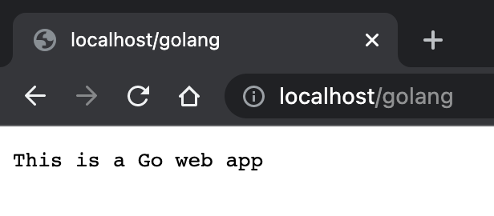
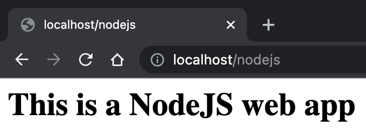
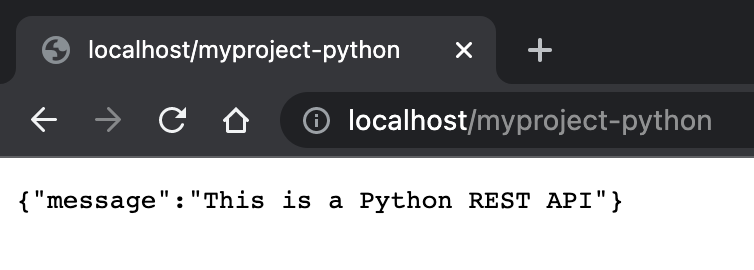
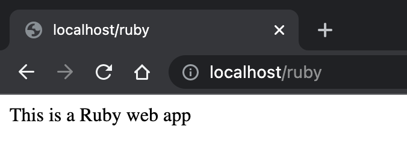
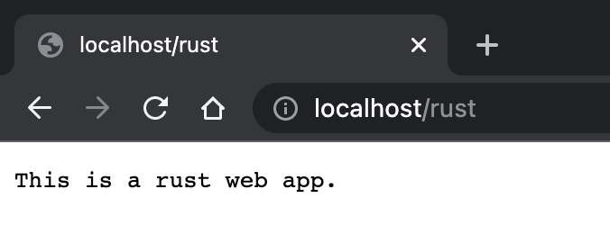

# Using Move2Kube CLI

## Description

In this tutorial we will see how we can transform a set of sample applications to run on Kubernetes. We will use the Move2Kube CLI tool to generate the Kubernetes yamls, Dockerfiles and build scripts for each application. We will then build the container images and deploy them to a cluster.

## Prerequisites

1. Install the [Move2Kube CLI tool](https://move2kube.konveyor.io/installation/cli/)

1. Download [language-platforms.zip](https://github.com/konveyor/move2kube-demos/raw/main/samples/language-platforms.zip) which we will be using for this tutorial. The language-platforms.zip file has a combination of multiple applications in different languages (Java, Go, Python, Ruby, etc.) which needs to be containerized and then put into Kubernetes.

## Steps to use the CLI to do a transformation

1. Unzip the `language-platforms.zip` file that we downloaded. We can see there are several directories. Each directory contains a simple web application written in different languages.
    <details markdown="block">
    <summary markdown="block">
    ```console
    # click to see the output
    $ curl -Lo language-platforms.zip https://github.com/konveyor/move2kube-demos/raw/b2653958ec51b1fd2f20e0ee6588da7c69a1d867/samples/language-platforms.zip
    $ unzip language-platforms.zip
    ```
    </summary>
    ```console
    $ curl -Lo language-platforms.zip https://github.com/konveyor/move2kube-demos/raw/b2653958ec51b1fd2f20e0ee6588da7c69a1d867/samples/language-platforms.zip
      % Total    % Received % Xferd  Average Speed   Time    Time     Time  Current
                                     Dload  Upload   Total   Spent    Left  Speed
    100   196  100   196    0     0    440      0 --:--:-- --:--:-- --:--:--   446
    100 53388  100 53388    0     0  48312      0  0:00:01  0:00:01 --:--:-- 1263k
    $ unzip language-platforms.zip 
    Archive:  language-platforms.zip
       creating: language-platforms/
     extracting: language-platforms/.m2kignore  
       creating: language-platforms/nodejs/
      inflating: language-platforms/nodejs/main.js  
      inflating: language-platforms/nodejs/package.json  
       creating: language-platforms/java-gradle-war/
      inflating: language-platforms/java-gradle-war/java-gradle-war.war  
       creating: language-platforms/python/
      inflating: language-platforms/python/requirements.txt  
      inflating: language-platforms/python/main.py  
       creating: language-platforms/golang/
      inflating: language-platforms/golang/go.mod  
      inflating: language-platforms/golang/main.go  
       creating: language-platforms/rust/
      inflating: language-platforms/rust/Cargo.toml  
      inflating: language-platforms/rust/Rocket.toml  
       creating: language-platforms/rust/src/
      inflating: language-platforms/rust/src/main.rs  
       creating: language-platforms/php/
      inflating: language-platforms/php/index.php  
      inflating: language-platforms/php/site.conf  
       creating: language-platforms/java-maven-war/
      inflating: language-platforms/java-maven-war/java-maven-war.war  
       creating: language-platforms/java-maven/
      inflating: language-platforms/java-maven/pom.xml  
       creating: language-platforms/java-maven/src/
       creating: language-platforms/java-maven/src/main/
       creating: language-platforms/java-maven/src/main/webapp/
      inflating: language-platforms/java-maven/src/main/webapp/index.jsp  
       creating: language-platforms/java-maven/src/main/webapp/WEB-INF/
      inflating: language-platforms/java-maven/src/main/webapp/WEB-INF/web.xml  
       creating: language-platforms/django/
      inflating: language-platforms/django/requirements.txt  
       creating: language-platforms/django/webroot/
       creating: language-platforms/django/webroot/migrations/
      inflating: language-platforms/django/webroot/migrations/__init__.py  
      inflating: language-platforms/django/webroot/models.py  
      inflating: language-platforms/django/webroot/__init__.py  
      inflating: language-platforms/django/webroot/apps.py  
      inflating: language-platforms/django/webroot/admin.py  
      inflating: language-platforms/django/webroot/tests.py  
      inflating: language-platforms/django/webroot/urls.py  
      inflating: language-platforms/django/webroot/views.py  
     extracting: language-platforms/django/db.sqlite3  
      inflating: language-platforms/django/Pipfile  
       creating: language-platforms/django/simplewebapp/
      inflating: language-platforms/django/simplewebapp/asgi.py  
      inflating: language-platforms/django/simplewebapp/__init__.py  
      inflating: language-platforms/django/simplewebapp/settings.py  
      inflating: language-platforms/django/simplewebapp/urls.py  
      inflating: language-platforms/django/simplewebapp/wsgi.py  
      inflating: language-platforms/django/manage.py  
      inflating: language-platforms/django/Pipfile.lock  
       creating: language-platforms/ruby/
      inflating: language-platforms/ruby/config.ru  
      inflating: language-platforms/ruby/ruby.rb  
      inflating: language-platforms/ruby/Gemfile  
       creating: language-platforms/ruby/views/
      inflating: language-platforms/ruby/views/main.erb  
       creating: language-platforms/java-gradle/
      inflating: language-platforms/java-gradle/build.gradle  
       creating: language-platforms/java-gradle/src/
       creating: language-platforms/java-gradle/src/main/
       creating: language-platforms/java-gradle/src/main/webapp/
       creating: language-platforms/java-gradle/src/main/webapp/WEB-INF/
      inflating: language-platforms/java-gradle/src/main/webapp/WEB-INF/web.xml  
       creating: language-platforms/java-gradle/src/main/java/
       creating: language-platforms/java-gradle/src/main/java/simplewebapp/
      inflating: language-platforms/java-gradle/src/main/java/simplewebapp/MainServlet.java   
    $ ls language-platforms
    django		golang		java-gradle	java-gradle-war	java-maven	java-maven-war	nodejs		php		python		ruby		rust
    ```
    </details>

1. Run `move2kube plan -s language-platforms` to generate a plan file. The `-s` flag is used to specify a source directory. Here we give `language-platforms` because we want
Move2Kube to analyze the sourcd code inside the `language-platforms` directory and come up with a plan for transforming them to Kubernetes YAMLs.
    <details markdown="block">
    <summary markdown="block">
    ```console
    # click to see the output
    $ move2kube plan -s language-platforms
    ```
    </summary>
    ```console
    $ move2kube plan -s language-platforms
    INFO[0000] Configuration loading done                   
    INFO[0000] Planning Transformation - Base Directory     
    INFO[0000] [CloudFoundry] Planning transformation       
    INFO[0000] [CloudFoundry] Done                          
    INFO[0000] [ComposeAnalyser] Planning transformation    
    INFO[0000] [ComposeAnalyser] Done                       
    INFO[0000] [DockerfileDetector] Planning transformation 
    INFO[0000] [DockerfileDetector] Done                    
    INFO[0000] [Base Directory] Identified 0 named services and 0 to-be-named services 
    INFO[0000] Transformation planning - Base Directory done 
    INFO[0000] Planning Transformation - Directory Walk     
    INFO[0000] Identified 1 named services and 0 to-be-named services in django 
    INFO[0000] Identified 1 named services and 0 to-be-named services in golang 
    INFO[0000] Identified 1 named services and 0 to-be-named services in java-gradle 
    INFO[0000] Identified 1 named services and 0 to-be-named services in java-gradle-war 
    INFO[0000] Identified 1 named services and 0 to-be-named services in java-maven 
    INFO[0000] Identified 1 named services and 0 to-be-named services in java-maven-war 
    INFO[0000] Identified 1 named services and 0 to-be-named services in nodejs 
    INFO[0000] Identified 1 named services and 0 to-be-named services in php 
    INFO[0000] Identified 1 named services and 0 to-be-named services in python 
    INFO[0000] Identified 1 named services and 0 to-be-named services in ruby 
    INFO[0000] Identified 1 named services and 0 to-be-named services in rust 
    INFO[0000] Transformation planning - Directory Walk done 
    INFO[0000] [Directory Walk] Identified 6 named services and 5 to-be-named services 
    INFO[0000] [Named Services] Identified 11 named services 
    INFO[0000] No of services identified : 11               
    INFO[0000] Plan can be found at [/Users/user/Desktop/tutorial/m2k.plan].
    ```
    </details>

1. Now let's look at the plan file we generated. The plan is in YAML format. We see that Move2Kube has detected all the different services, one for each web app.

    ```console
    $ ls
    language-platforms	language-platforms.zip	m2k.plan
    $ cat m2k.plan 
    ```

    <details markdown="block">
    <summary markdown="block">
    ```yaml
    # click to see the full plan yaml
    apiVersion: move2kube.konveyor.io/v1alpha1
    kind: Plan
    ......
    ```
    </summary>
    ```yaml
    apiVersion: move2kube.konveyor.io/v1alpha1
    kind: Plan
    metadata:
      name: myproject
    spec:
      sourceDir: language-platforms
      services:
        golang:
          - transformerName: Golang-Dockerfile
            paths:
              GoModFilePath:
                - golang/go.mod
              ServiceDirPath:
                - golang
        myproject-django:
          - transformerName: Python-Dockerfile
            paths:
              MainPythonFilesPathType: []
              PythonFilesPathType:
                - django/manage.py
              RequirementsTxtPathType:
                - django/requirements.txt
              ServiceDirPath:
                - django
            configs:
              PythonConfig:
                IsDjango: true
        myproject-java-gradle:
          - transformerName: Gradle
            paths:
              GradleBuildFile:
                - java-gradle/build.gradle
              ServiceDirPath:
                - java-gradle
            configs:
              Gradle:
                artifactType: jar
        myproject-java-gradle-war:
          - transformerName: WarAnalyser
            paths:
              ServiceDirPath:
                - java-gradle-war
              War:
                - java-gradle-war/java-gradle-war.war
            configs:
              War:
                deploymentFile: java-gradle-war.war
                javaVersion: ""
                buildContainerName: ""
                deploymentFileDirInBuildContainer: ""
                envVariables: {}
        myproject-java-maven-war:
          - transformerName: WarAnalyser
            paths:
              ServiceDirPath:
                - java-maven-war
              War:
                - java-maven-war/java-maven-war.war
            configs:
              War:
                deploymentFile: java-maven-war.war
                javaVersion: ""
                buildContainerName: ""
                deploymentFileDirInBuildContainer: ""
                envVariables: {}
        myproject-php:
          - transformerName: PHP-Dockerfile
            paths:
              ServiceDirPath:
                - php
        myproject-python:
          - transformerName: Python-Dockerfile
            paths:
              MainPythonFilesPathType: []
              PythonFilesPathType:
                - python/main.py
              RequirementsTxtPathType:
                - python/requirements.txt
              ServiceDirPath:
                - python
            configs:
              PythonConfig:
                IsDjango: false
        nodejs:
          - transformerName: Nodejs-Dockerfile
            paths:
              ServiceDirPath:
                - nodejs
        ruby:
          - transformerName: Ruby-Dockerfile
            paths:
              ServiceDirPath:
                - ruby
        rust:
          - transformerName: Rust-Dockerfile
            paths:
              ServiceDirPath:
                - rust
        simplewebapp:
          - transformerName: Maven
            paths:
              MavenPom:
                - java-maven/pom.xml
              ServiceDirPath:
                - java-maven
            configs:
              Maven:
                mavenAppName: simplewebapp
                artifactType: war
      transformers:
        Buildconfig: m2kassets/inbuilt/transformers/kubernetes/buildconfig/buildconfig.yaml
        CloudFoundry: m2kassets/inbuilt/transformers/cloudfoundry/cloudfoundry.yaml
        ClusterSelector: m2kassets/inbuilt/transformers/kubernetes/clusterselector/clusterselector.yaml
        ComposeAnalyser: m2kassets/inbuilt/transformers/compose/composeanalyser/composeanalyser.yaml
        ComposeGenerator: m2kassets/inbuilt/transformers/compose/composegenerator/composegenerator.yaml
        ContainerImagesPushScriptGenerator: m2kassets/inbuilt/transformers/containerimage/containerimagespushscript/containerimagespushscript.yaml
        DockerfileDetector: m2kassets/inbuilt/transformers/dockerfile/dockerfiledetector/dockerfiledetector.yaml
        DockerfileImageBuildScript: m2kassets/inbuilt/transformers/dockerfile/dockerimagebuildscript/dockerfilebuildscriptgenerator.yaml
        DockerfileParser: m2kassets/inbuilt/transformers/dockerfile/dockerfileparser/dockerfileparser.yaml
        DotNetCore-Dockerfile: m2kassets/inbuilt/transformers/dockerfilegenerator/dotnetcore/dotnetcore.yaml
        EarAnalyser: m2kassets/inbuilt/transformers/dockerfilegenerator/java/earanalyser/ear.yaml
        EarRouter: m2kassets/inbuilt/transformers/dockerfilegenerator/java/earrouter/earrouter.yaml
        Golang-Dockerfile: m2kassets/inbuilt/transformers/dockerfilegenerator/golang/golang.yaml
        Gradle: m2kassets/inbuilt/transformers/dockerfilegenerator/java/gradle/gradle.yaml
        Jar: m2kassets/inbuilt/transformers/dockerfilegenerator/java/jar/jar.yaml
        Jboss: m2kassets/inbuilt/transformers/dockerfilegenerator/java/jboss/jboss.yaml
        Knative: m2kassets/inbuilt/transformers/kubernetes/knative/knative.yaml
        Kubernetes: m2kassets/inbuilt/transformers/kubernetes/kubernetes/kubernetes.yaml
        KubernetesVersionChanger: m2kassets/inbuilt/transformers/kubernetes/kubernetesversionchanger/kubernetesversionchanger.yaml
        Liberty: m2kassets/inbuilt/transformers/dockerfilegenerator/java/liberty/liberty.yaml
        Maven: m2kassets/inbuilt/transformers/dockerfilegenerator/java/maven/maven.yaml
        Nodejs-Dockerfile: m2kassets/inbuilt/transformers/dockerfilegenerator/nodejs/nodejs.yaml
        PHP-Dockerfile: m2kassets/inbuilt/transformers/dockerfilegenerator/php/php.yaml
        Parameterizer: m2kassets/inbuilt/transformers/kubernetes/parameterizer/parameterizer.yaml
        Python-Dockerfile: m2kassets/inbuilt/transformers/dockerfilegenerator/python/python.yaml
        ReadMeGenerator: m2kassets/inbuilt/transformers/readmegenerator/readmegenerator.yaml
        Ruby-Dockerfile: m2kassets/inbuilt/transformers/dockerfilegenerator/ruby/ruby.yaml
        Rust-Dockerfile: m2kassets/inbuilt/transformers/dockerfilegenerator/rust/rust.yaml
        Tekton: m2kassets/inbuilt/transformers/kubernetes/tekton/tekton.yaml
        Tomcat: m2kassets/inbuilt/transformers/dockerfilegenerator/java/tomcat/tomcat.yaml
        WarAnalyser: m2kassets/inbuilt/transformers/dockerfilegenerator/java/waranalyser/war.yaml
        WarRouter: m2kassets/inbuilt/transformers/dockerfilegenerator/java/warrouter/warrouter.yaml
        WinConsoleApp-Dockerfile: m2kassets/inbuilt/transformers/dockerfilegenerator/windows/winconsole/winconsole.yaml
        WinSLWebApp-Dockerfile: m2kassets/inbuilt/transformers/dockerfilegenerator/windows/winsilverlightweb/winsilverlightweb.yaml
        WinWebApp-Dockerfile: m2kassets/inbuilt/transformers/dockerfilegenerator/windows/winweb/winweb.yaml
        ZuulAnalyser: m2kassets/inbuilt/transformers/dockerfilegenerator/java/zuul/zuulanalyser.yaml
    ```
    </details>

1. Now let's run the transformation using `move2kube transform`. This will do the transformation according to the plan we generated. By default Move2Kube looks for a plan file in the current directory. If you want to specify the path to a different plan file you can do so using the `-p` flag. During transformation Move2Kube will ask us several questions to help guide the transformation process. For most questions we can go with the default answers. Some questions to watch out for are:
    - The container registry and namespace that you want to use. A container registry is where all the images are stored (Example: Quay, Docker Hub, etc.)
    - The ingress hostname and ingress TLS secret. If you are deploying to MiniKube then give `localhost` as the ingress host and leave the TLS secret blank.

    For all other questions we will go with the default answers by pressing `Enter` for each question.
    <details markdown="block">
    <summary markdown="block">
    ```console
    # click to see the output
    $ move2kube transform
    ```
    </summary>
    ```console
    $ move2kube transform
    INFO[0000] Detected a plan file at path /Users/user/Desktop/tutorial/m2k.plan. Will transform using this plan. 
    ? Select all transformer types that you are interested in:
    Hints:
    [Services that don't support any of the transformer types you are interested in will be ignored.]
     ComposeGenerator, DockerfileDetector, Jboss, WinSLWebApp-Dockerfile, ZuulAnalyser, Buildconfig, Maven, Tekton, Tomcat, WarRouter, WinConsoleApp-Dockerfile,    DotNetCore-Dockerfile, EarAnalyser, KubernetesVersionChanger, Nodejs-Dockerfile, Ruby-Dockerfile, WinWebApp-Dockerfile, CloudFoundry, ComposeAnalyser, DockerfileParser,   EarRouter, Gradle, ClusterSelector, Rust-Dockerfile, ContainerImagesPushScriptGenerator, ReadMeGenerator, WarAnalyser, Jar, Golang-Dockerfile, Knative, Kubernetes, Liberty,  PHP-Dockerfile, Parameterizer, Python-Dockerfile, DockerfileImageBuildScript
    ? Select all services that are needed:
    Hints:
    [The services unselected here will be ignored.]
     golang, myproject-python, nodejs, rust, simplewebapp, myproject-django, myproject-java-gradle, myproject-java-gradle-war, myproject-java-maven-war, myproject-php, ruby
    INFO[0009] Starting Plan Transformation                 
    INFO[0009] Iteration 1                                  
    INFO[0009] Iteration 2 - 11 artifacts to process        
    INFO[0009] Transformer Maven processing 1 artifacts     
    INFO[0009] Transformer WarRouter processing 2 artifacts 
    ? Select the transformer to use for service simplewebapp
     Tomcat
    INFO[0014] Transformer WarRouter Done                   
    INFO[0014] Transformer Maven Done                       
    INFO[0014] Transformer PHP-Dockerfile processing 1 artifacts 
    INFO[0014] Transformer PHP-Dockerfile Done              
    INFO[0014] Transformer Nodejs-Dockerfile processing 1 artifacts 
    ? Enter the port to be exposed for the service nodejs: 
    Hints:
    [The service nodejs will be exposed to the specified port]
     8080
    INFO[0016] Transformer Nodejs-Dockerfile Done           
    INFO[0016] Transformer Ruby-Dockerfile processing 1 artifacts 
    ? Select port to be exposed for the service ruby :
    Hints:
    [Select Other if you want to expose the service ruby to some other port]
     8080
    INFO[0017] Transformer Ruby-Dockerfile Done             
    INFO[0017] Transformer WarAnalyser processing 2 artifacts 
    INFO[0017] Transformer WarRouter processing 3 artifacts 
    ? Select the transformer to use for service myproject-java-gradle-war
     Tomcat
    ? Select the transformer to use for service myproject-java-maven-war
     Tomcat
    INFO[0020] Transformer WarRouter Done                   
    INFO[0020] Transformer WarAnalyser Done                 
    INFO[0020] Transformer Golang-Dockerfile processing 1 artifacts 
    ? Select ports to be exposed for the service golang :
    Hints:
    [Select Other if you want to add more ports]
     8080
    INFO[0021] Transformer Golang-Dockerfile Done           
    INFO[0021] Transformer Gradle processing 1 artifacts    
    ? Select port to be exposed for the service myproject-java-gradle :
    Hints:
    [Select Other if you want to expose the service myproject-java-gradle to some other port]
     8080
    INFO[0022] Transformer Gradle Done                      
    INFO[0022] Transformer Rust-Dockerfile processing 1 artifacts 
    ? Select port to be exposed for the service rust :
    Hints:
    [Select Other if you want to expose the service rust to some other port]
     8085
    INFO[0023] Transformer Rust-Dockerfile Done             
    INFO[0023] Transformer Python-Dockerfile processing 2 artifacts 
    ? Select port to be exposed for the service myproject-django :
    Hints:
    [Select Other if you want to expose the service myproject-django to some other port]
     8080
    ? Select port to be exposed for the service myproject-python :
    Hints:
    [Select Other if you want to expose the service myproject-python to some other port]
     8080
    INFO[0024] Transformer Python-Dockerfile Done           
    INFO[0024] Created 16 pathMappings and 20 artifacts. Total Path Mappings : 16. Total Artifacts : 11. 
    INFO[0024] Iteration 3 - 20 artifacts to process        
    INFO[0024] Transformer DockerfileImageBuildScript processing 8 artifacts 
    ? Select the container runtime to use :
    Hints:
    [The container runtime selected will be used in the scripts]
     docker
    INFO[0028] Transformer DockerfileImageBuildScript Done  
    INFO[0028] Transformer Jar processing 1 artifacts       
    INFO[0028] Transformer Jar Done                         
    INFO[0028] Transformer DockerfileParser processing 7 artifacts 
    INFO[0028] Transformer ZuulAnalyser processing 2 artifacts 
    INFO[0028] Transformer ZuulAnalyser Done                
    INFO[0028] Transformer DockerfileParser Done            
    INFO[0028] Transformer Tomcat processing 4 artifacts    
    INFO[0028] Transformer Tomcat Done                      
    INFO[0028] Created 11 pathMappings and 20 artifacts. Total Path Mappings : 27. Total Artifacts : 31. 
    INFO[0028] Iteration 4 - 20 artifacts to process        
    INFO[0028] Transformer ClusterSelector processing 2 artifacts 
    ? Choose the cluster type:
    Hints:
    [Choose the cluster type you would like to target]
     Kubernetes
    INFO[0030] Transformer ClusterSelector Done             
    INFO[0030] Transformer Tekton processing 2 artifacts    
    ? What URL/path should we expose the service rust's 8085 port on?
    Hints:
    [Enter :- not expose the service, Leave out leading / to use first part as subdomain, Add :N as suffix for NodePort service type, Add :L for Load Balancer service type]
     /rust
    ? What URL/path should we expose the service golang's 8080 port on?
    Hints:
    [Enter :- not expose the service, Leave out leading / to use first part as subdomain, Add :N as suffix for NodePort service type, Add :L for Load Balancer service type]
     /golang
    ? What URL/path should we expose the service ruby's 8080 port on?
    Hints:
    [Enter :- not expose the service, Leave out leading / to use first part as subdomain, Add :N as suffix for NodePort service type, Add :L for Load Balancer service type]
     /ruby
    ? What URL/path should we expose the service myproject-python's 8080 port on?
    Hints:
    [Enter :- not expose the service, Leave out leading / to use first part as subdomain, Add :N as suffix for NodePort service type, Add :L for Load Balancer service type]
     /myproject-python
    ? What URL/path should we expose the service nodejs's 8080 port on?
    Hints:
    [Enter :- not expose the service, Leave out leading / to use first part as subdomain, Add :N as suffix for NodePort service type, Add :L for Load Balancer service type]
     /nodejs
    ? What URL/path should we expose the service myproject-php's 8082 port on?
    Hints:
    [Enter :- not expose the service, Leave out leading / to use first part as subdomain, Add :N as suffix for NodePort service type, Add :L for Load Balancer service type]
     /myproject-php
    ? What URL/path should we expose the service myproject-django's 8080 port on?
    Hints:
    [Enter :- not expose the service, Leave out leading / to use first part as subdomain, Add :N as suffix for NodePort service type, Add :L for Load Balancer service type]
     /myproject-django
    ? Provide the minimum number of replicas each service should have
    Hints:
    [If the value is 0 pods won't be started by default]
     2
    ? Enter the URL of the image registry : 
    Hints:
    [You can always change it later by changing the yamls.]
     quay.io
    ? Enter the namespace where the new images should be pushed : 
    Hints:
    [Ex : myproject]
     move2kube
    ? [quay.io] What type of container registry login do you want to use?
    Hints:
    [Docker login from config mode, will use the default config from your local machine.]
     No authentication
    ? Provide the ingress host domain
    Hints:
    [Ingress host domain is part of service URL]
     localhost
    ? Provide the TLS secret for ingress
    Hints:
    [Leave empty to use http]
    
    INFO[0049] Transformer Tekton Done                      
    INFO[0049] Transformer ClusterSelector processing 2 artifacts 
    INFO[0049] Transformer ClusterSelector Done             
    INFO[0049] Transformer Knative processing 2 artifacts   
    INFO[0050] Transformer Knative Done                     
    INFO[0050] Transformer ComposeGenerator processing 2 artifacts 
    INFO[0050] Transformer ComposeGenerator Done            
    INFO[0050] Transformer ClusterSelector processing 2 artifacts 
    INFO[0050] Transformer ClusterSelector Done             
    INFO[0050] Transformer Kubernetes processing 2 artifacts 
    INFO[0050] Transformer Kubernetes Done                  
    INFO[0050] Transformer ContainerImagesPushScriptGenerator processing 2 artifacts 
    INFO[0050] Transformer ContainerImagesPushScriptGenerator Done 
    INFO[0050] Transformer DockerfileImageBuildScript processing 5 artifacts 
    INFO[0050] Transformer DockerfileImageBuildScript Done  
    INFO[0050] Transformer DockerfileParser processing 5 artifacts 
    INFO[0050] Transformer ZuulAnalyser processing 2 artifacts 
    INFO[0050] Transformer ZuulAnalyser Done                
    INFO[0050] Transformer DockerfileParser Done            
    INFO[0050] Transformer ClusterSelector processing 2 artifacts 
    INFO[0050] Transformer ClusterSelector Done             
    INFO[0050] Transformer Buildconfig processing 2 artifacts 
    INFO[0050] Transformer Buildconfig Done                 
    INFO[0050] Created 40 pathMappings and 21 artifacts. Total Path Mappings : 67. Total Artifacts : 51. 
    INFO[0050] Iteration 5 - 21 artifacts to process        
    INFO[0050] Transformer ClusterSelector processing 2 artifacts 
    INFO[0050] Transformer ClusterSelector Done             
    INFO[0050] Transformer Buildconfig processing 2 artifacts 
    ? What URL/path should we expose the service simplewebapp's 8080 port on?
    Hints:
    [Enter :- not expose the service, Leave out leading / to use first part as subdomain, Add :N as suffix for NodePort service type, Add :L for Load Balancer service type]
     /simplewebapp
    ? What URL/path should we expose the service myproject-java-gradle's 8080 port on?
    Hints:
    [Enter :- not expose the service, Leave out leading / to use first part as subdomain, Add :N as suffix for NodePort service type, Add :L for Load Balancer service type]
     /myproject-java-gradle
    ? What URL/path should we expose the service myproject-java-gradle-war's 8080 port on?
    Hints:
    [Enter :- not expose the service, Leave out leading / to use first part as subdomain, Add :N as suffix for NodePort service type, Add :L for Load Balancer service type]
     /myproject-java-gradle-war
    ? What URL/path should we expose the service myproject-java-maven-war's 8080 port on?
    Hints:
    [Enter :- not expose the service, Leave out leading / to use first part as subdomain, Add :N as suffix for NodePort service type, Add :L for Load Balancer service type]
     /myproject-java-maven-war
    INFO[0054] Transformer Buildconfig Done                 
    INFO[0054] Transformer ReadMeGenerator processing 5 artifacts 
    INFO[0054] Transformer ReadMeGenerator Done             
    INFO[0054] Transformer ClusterSelector processing 2 artifacts 
    INFO[0054] Transformer ClusterSelector Done             
    INFO[0054] Transformer Knative processing 2 artifacts   
    INFO[0055] Transformer Knative Done                     
    INFO[0055] Transformer ClusterSelector processing 2 artifacts 
    INFO[0055] Transformer ClusterSelector Done             
    INFO[0055] Transformer Tekton processing 2 artifacts    
    INFO[0055] Transformer Tekton Done                      
    INFO[0055] Transformer ClusterSelector processing 2 artifacts 
    INFO[0055] Transformer ClusterSelector Done             
    INFO[0055] Transformer Kubernetes processing 2 artifacts 
    INFO[0055] Transformer Kubernetes Done                  
    INFO[0055] Transformer ComposeGenerator processing 2 artifacts 
    INFO[0055] Transformer ComposeGenerator Done            
    INFO[0055] Transformer ContainerImagesPushScriptGenerator processing 2 artifacts 
    INFO[0055] Transformer ContainerImagesPushScriptGenerator Done 
    INFO[0055] Transformer Parameterizer processing 4 artifacts 
    INFO[0055] Transformer Parameterizer Done               
    INFO[0056] Created 60 pathMappings and 7 artifacts. Total Path Mappings : 127. Total Artifacts : 72. 
    INFO[0056] Iteration 6 - 7 artifacts to process         
    INFO[0056] Transformer Parameterizer processing 4 artifacts 
    INFO[0056] Transformer Parameterizer Done               
    INFO[0056] Transformer ReadMeGenerator processing 5 artifacts 
    INFO[0056] Transformer ReadMeGenerator Done             
    INFO[0056] Plan Transformation done                     
    INFO[0056] Transformed target artifacts can be found at [/Users/user/Desktop/tutorial/myproject]. 
    ```
    </details>

1. After the questions are finished wait a few minutes for it to finish processing. Once it's done, we can see it has generated a directory called `myproject`.
The name of the output directory is the same as the project name (by default `myproject`). The project name be changed using the `-n` flag.

    ```console
    $ ls
    language-platforms	language-platforms.zip	m2k.plan		m2kconfig.yaml		m2kqacache.yaml		myproject
    $ ls myproject/
    Readme.md	deploy		scripts		source
    ```

    The applications can now be deployed to Kubernetes using these generated artifacts.

## Deploying the application to Kubernetes with the generated artifacts

1. The full structure of the output directory can be seen by executing the `tree` command.

    <details markdown="block">
    <summary markdown="block">
    ```console
    # click to see the output
    $ cd myproject/
    $ tree
    ```
    </summary>
    ```console
    $ cd myproject/
    $ tree
    .
    ├── Readme.md
    ├── deploy
    │   ├── cicd
    │   │   ├── tekton
    │   │   │   ├── myproject-clone-build-push-pipeline.yaml
    │   │   │   ├── myproject-clone-push-serviceaccount.yaml
    │   │   │   ├── myproject-git-event-triggerbinding.yaml
    │   │   │   ├── myproject-git-repo-eventlistener.yaml
    │   │   │   ├── myproject-image-registry-secret.yaml
    │   │   │   ├── myproject-ingress.yaml
    │   │   │   ├── myproject-run-clone-build-push-triggertemplate.yaml
    │   │   │   ├── myproject-tekton-triggers-admin-role.yaml
    │   │   │   ├── myproject-tekton-triggers-admin-rolebinding.yaml
    │   │   │   └── myproject-tekton-triggers-admin-serviceaccount.yaml
    │   │   └── tekton-parameterized
    │   │       ├── helm-chart
    │   │       │   └── myproject
    │   │       │       ├── Chart.yaml
    │   │       │       └── templates
    │   │       │           ├── myproject-clone-build-push-pipeline.yaml
    │   │       │           ├── myproject-clone-push-serviceaccount.yaml
    │   │       │           ├── myproject-git-event-triggerbinding.yaml
    │   │       │           ├── myproject-git-repo-eventlistener.yaml
    │   │       │           ├── myproject-image-registry-secret.yaml
    │   │       │           ├── myproject-ingress.yaml
    │   │       │           ├── myproject-run-clone-build-push-triggertemplate.yaml
    │   │       │           ├── myproject-tekton-triggers-admin-role.yaml
    │   │       │           ├── myproject-tekton-triggers-admin-rolebinding.yaml
    │   │       │           └── myproject-tekton-triggers-admin-serviceaccount.yaml
    │   │       ├── kustomize
    │   │       │   └── base
    │   │       │       ├── kustomization.yaml
    │   │       │       ├── myproject-clone-build-push-pipeline.yaml
    │   │       │       ├── myproject-clone-push-serviceaccount.yaml
    │   │       │       ├── myproject-git-event-triggerbinding.yaml
    │   │       │       ├── myproject-git-repo-eventlistener.yaml
    │   │       │       ├── myproject-image-registry-secret.yaml
    │   │       │       ├── myproject-ingress.yaml
    │   │       │       ├── myproject-run-clone-build-push-triggertemplate.yaml
    │   │       │       ├── myproject-tekton-triggers-admin-role.yaml
    │   │       │       ├── myproject-tekton-triggers-admin-rolebinding.yaml
    │   │       │       └── myproject-tekton-triggers-admin-serviceaccount.yaml
    │   │       └── openshift-template
    │   │           └── template.yaml
    │   ├── compose
    │   │   └── docker-compose.yaml
    │   ├── knative
    │   │   ├── golang-service.yaml
    │   │   ├── myproject-django-service.yaml
    │   │   ├── myproject-java-gradle-service.yaml
    │   │   ├── myproject-java-gradle-war-service.yaml
    │   │   ├── myproject-java-maven-war-service.yaml
    │   │   ├── myproject-php-service.yaml
    │   │   ├── myproject-python-service.yaml
    │   │   ├── nodejs-service.yaml
    │   │   ├── ruby-service.yaml
    │   │   ├── rust-service.yaml
    │   │   └── simplewebapp-service.yaml
    │   ├── knative-parameterized
    │   │   ├── helm-chart
    │   │   │   └── myproject
    │   │   │       ├── Chart.yaml
    │   │   │       └── templates
    │   │   │           ├── golang-service.yaml
    │   │   │           ├── myproject-django-service.yaml
    │   │   │           ├── myproject-java-gradle-service.yaml
    │   │   │           ├── myproject-java-gradle-war-service.yaml
    │   │   │           ├── myproject-java-maven-war-service.yaml
    │   │   │           ├── myproject-php-service.yaml
    │   │   │           ├── myproject-python-service.yaml
    │   │   │           ├── nodejs-service.yaml
    │   │   │           ├── ruby-service.yaml
    │   │   │           ├── rust-service.yaml
    │   │   │           └── simplewebapp-service.yaml
    │   │   ├── kustomize
    │   │   │   └── base
    │   │   │       ├── golang-service.yaml
    │   │   │       ├── kustomization.yaml
    │   │   │       ├── myproject-django-service.yaml
    │   │   │       ├── myproject-java-gradle-service.yaml
    │   │   │       ├── myproject-java-gradle-war-service.yaml
    │   │   │       ├── myproject-java-maven-war-service.yaml
    │   │   │       ├── myproject-php-service.yaml
    │   │   │       ├── myproject-python-service.yaml
    │   │   │       ├── nodejs-service.yaml
    │   │   │       ├── ruby-service.yaml
    │   │   │       ├── rust-service.yaml
    │   │   │       └── simplewebapp-service.yaml
    │   │   └── openshift-template
    │   │       └── template.yaml
    │   ├── yamls
    │   │   ├── golang-deployment.yaml
    │   │   ├── golang-service.yaml
    │   │   ├── myproject-django-deployment.yaml
    │   │   ├── myproject-django-service.yaml
    │   │   ├── myproject-ingress.yaml
    │   │   ├── myproject-java-gradle-deployment.yaml
    │   │   ├── myproject-java-gradle-service.yaml
    │   │   ├── myproject-java-gradle-war-deployment.yaml
    │   │   ├── myproject-java-gradle-war-service.yaml
    │   │   ├── myproject-java-maven-war-deployment.yaml
    │   │   ├── myproject-java-maven-war-service.yaml
    │   │   ├── myproject-php-deployment.yaml
    │   │   ├── myproject-php-service.yaml
    │   │   ├── myproject-python-deployment.yaml
    │   │   ├── myproject-python-service.yaml
    │   │   ├── nodejs-deployment.yaml
    │   │   ├── nodejs-service.yaml
    │   │   ├── ruby-deployment.yaml
    │   │   ├── ruby-service.yaml
    │   │   ├── rust-deployment.yaml
    │   │   ├── rust-service.yaml
    │   │   ├── simplewebapp-deployment.yaml
    │   │   └── simplewebapp-service.yaml
    │   └── yamls-parameterized
    │       ├── helm-chart
    │       │   └── myproject
    │       │       ├── Chart.yaml
    │       │       ├── templates
    │       │       │   ├── golang-deployment.yaml
    │       │       │   ├── golang-service.yaml
    │       │       │   ├── myproject-django-deployment.yaml
    │       │       │   ├── myproject-django-service.yaml
    │       │       │   ├── myproject-ingress.yaml
    │       │       │   ├── myproject-java-gradle-deployment.yaml
    │       │       │   ├── myproject-java-gradle-service.yaml
    │       │       │   ├── myproject-java-gradle-war-deployment.yaml
    │       │       │   ├── myproject-java-gradle-war-service.yaml
    │       │       │   ├── myproject-java-maven-war-deployment.yaml
    │       │       │   ├── myproject-java-maven-war-service.yaml
    │       │       │   ├── myproject-php-deployment.yaml
    │       │       │   ├── myproject-php-service.yaml
    │       │       │   ├── myproject-python-deployment.yaml
    │       │       │   ├── myproject-python-service.yaml
    │       │       │   ├── nodejs-deployment.yaml
    │       │       │   ├── nodejs-service.yaml
    │       │       │   ├── ruby-deployment.yaml
    │       │       │   ├── ruby-service.yaml
    │       │       │   ├── rust-deployment.yaml
    │       │       │   ├── rust-service.yaml
    │       │       │   ├── simplewebapp-deployment.yaml
    │       │       │   └── simplewebapp-service.yaml
    │       │       ├── values-dev.yaml
    │       │       ├── values-prod.yaml
    │       │       └── values-staging.yaml
    │       ├── kustomize
    │       │   ├── base
    │       │   │   ├── golang-deployment.yaml
    │       │   │   ├── golang-service.yaml
    │       │   │   ├── kustomization.yaml
    │       │   │   ├── myproject-django-deployment.yaml
    │       │   │   ├── myproject-django-service.yaml
    │       │   │   ├── myproject-ingress.yaml
    │       │   │   ├── myproject-java-gradle-deployment.yaml
    │       │   │   ├── myproject-java-gradle-service.yaml
    │       │   │   ├── myproject-java-gradle-war-deployment.yaml
    │       │   │   ├── myproject-java-gradle-war-service.yaml
    │       │   │   ├── myproject-java-maven-war-deployment.yaml
    │       │   │   ├── myproject-java-maven-war-service.yaml
    │       │   │   ├── myproject-php-deployment.yaml
    │       │   │   ├── myproject-php-service.yaml
    │       │   │   ├── myproject-python-deployment.yaml
    │       │   │   ├── myproject-python-service.yaml
    │       │   │   ├── nodejs-deployment.yaml
    │       │   │   ├── nodejs-service.yaml
    │       │   │   ├── ruby-deployment.yaml
    │       │   │   ├── ruby-service.yaml
    │       │   │   ├── rust-deployment.yaml
    │       │   │   ├── rust-service.yaml
    │       │   │   ├── simplewebapp-deployment.yaml
    │       │   │   └── simplewebapp-service.yaml
    │       │   └── overlays
    │       │       ├── dev
    │       │       │   ├── apps-v1-deployment-golang.yaml
    │       │       │   ├── apps-v1-deployment-myproject-django.yaml
    │       │       │   ├── apps-v1-deployment-myproject-java-gradle-war.yaml
    │       │       │   ├── apps-v1-deployment-myproject-java-gradle.yaml
    │       │       │   ├── apps-v1-deployment-myproject-java-maven-war.yaml
    │       │       │   ├── apps-v1-deployment-myproject-php.yaml
    │       │       │   ├── apps-v1-deployment-myproject-python.yaml
    │       │       │   ├── apps-v1-deployment-nodejs.yaml
    │       │       │   ├── apps-v1-deployment-ruby.yaml
    │       │       │   ├── apps-v1-deployment-rust.yaml
    │       │       │   ├── apps-v1-deployment-simplewebapp.yaml
    │       │       │   └── kustomization.yaml
    │       │       ├── prod
    │       │       │   ├── apps-v1-deployment-golang.yaml
    │       │       │   ├── apps-v1-deployment-myproject-django.yaml
    │       │       │   ├── apps-v1-deployment-myproject-java-gradle-war.yaml
    │       │       │   ├── apps-v1-deployment-myproject-java-gradle.yaml
    │       │       │   ├── apps-v1-deployment-myproject-java-maven-war.yaml
    │       │       │   ├── apps-v1-deployment-myproject-php.yaml
    │       │       │   ├── apps-v1-deployment-myproject-python.yaml
    │       │       │   ├── apps-v1-deployment-nodejs.yaml
    │       │       │   ├── apps-v1-deployment-ruby.yaml
    │       │       │   ├── apps-v1-deployment-rust.yaml
    │       │       │   ├── apps-v1-deployment-simplewebapp.yaml
    │       │       │   └── kustomization.yaml
    │       │       └── staging
    │       │           ├── apps-v1-deployment-golang.yaml
    │       │           ├── apps-v1-deployment-myproject-django.yaml
    │       │           ├── apps-v1-deployment-myproject-java-gradle-war.yaml
    │       │           ├── apps-v1-deployment-myproject-java-gradle.yaml
    │       │           ├── apps-v1-deployment-myproject-java-maven-war.yaml
    │       │           ├── apps-v1-deployment-myproject-php.yaml
    │       │           ├── apps-v1-deployment-myproject-python.yaml
    │       │           ├── apps-v1-deployment-nodejs.yaml
    │       │           ├── apps-v1-deployment-ruby.yaml
    │       │           ├── apps-v1-deployment-rust.yaml
    │       │           ├── apps-v1-deployment-simplewebapp.yaml
    │       │           └── kustomization.yaml
    │       └── openshift-template
    │           ├── parameters-dev.yaml
    │           ├── parameters-prod.yaml
    │           ├── parameters-staging.yaml
    │           └── template.yaml
    ├── scripts
    │   ├── builddockerimages.bat
    │   ├── builddockerimages.sh
    │   ├── pushimages.bat
    │   └── pushimages.sh
    └── source
        ├── django
        │   ├── Dockerfile
        │   ├── Pipfile
        │   ├── Pipfile.lock
        │   ├── db.sqlite3
        │   ├── manage.py
        │   ├── requirements.txt
        │   ├── simplewebapp
        │   │   ├── __init__.py
        │   │   ├── asgi.py
        │   │   ├── settings.py
        │   │   ├── urls.py
        │   │   └── wsgi.py
        │   └── webroot
        │       ├── __init__.py
        │       ├── admin.py
        │       ├── apps.py
        │       ├── migrations
        │       │   └── __init__.py
        │       ├── models.py
        │       ├── tests.py
        │       ├── urls.py
        │       └── views.py
        ├── golang
        │   ├── Dockerfile
        │   ├── go.mod
        │   └── main.go
        ├── java-gradle
        │   ├── Dockerfile
        │   ├── build.gradle
        │   └── src
        │       └── main
        │           ├── java
        │           │   └── simplewebapp
        │           │       └── MainServlet.java
        │           └── webapp
        │               └── WEB-INF
        │                   └── web.xml
        ├── java-gradle-war
        │   ├── Dockerfile
        │   └── java-gradle-war.war
        ├── java-maven
        │   ├── Dockerfile
        │   ├── pom.xml
        │   └── src
        │       └── main
        │           └── webapp
        │               ├── WEB-INF
        │               │   └── web.xml
        │               └── index.jsp
        ├── java-maven-war
        │   ├── Dockerfile
        │   └── java-maven-war.war
        ├── nodejs
        │   ├── Dockerfile
        │   ├── main.js
        │   └── package.json
        ├── php
        │   ├── Dockerfile
        │   ├── index.php
        │   └── site.conf
        ├── python
        │   ├── Dockerfile
        │   ├── main.py
        │   └── requirements.txt
        ├── ruby
        │   ├── Dockerfile
        │   ├── Gemfile
        │   ├── config.ru
        │   ├── ruby.rb
        │   └── views
        │       └── main.erb
        └── rust
            ├── Cargo.toml
            ├── Dockerfile
            ├── Rocket.toml
            └── src
                └── main.rs

    59 directories, 241 files
    ```
    </details>

    The CLI has created Kubernetes YAMLs for us which are stored inside the `deploy/yamls` directory. For each of the directories and the services identified, it has created the deployment artifacts, service artifacts and the ingress as required.  The `scripts` directory contains the scripts for building the images for the applications using Dockerfiles.

    Many scripts like `buildimages.sh` and `pushimages.sh` are also present inside the directory. It has also created a simple `deploy/compose/docker-compose.yaml` for you, so that you can test the images locally if you want. It has also created Tekton artifacts inside the `deploy/cicd/tekton` directory that are required if you want to use Tekton as your CI/CD pipeline.

    The `Readme.md` file guides on the next steps to be followed.

    ```console
    $ cat Readme.md
    Move2Kube
    ---------
    Congratulations! Move2Kube has generated the necessary build artfiacts for moving all your application components to Kubernetes. Using the artifacts in this directory you can deploy your application in a kubernetes cluster.

    Next Steps
    ----------
    To try locally use the scripts in the "./scripts" directory, to build, push and deploy. 

    For production usage use the CI/CD pipelines for deployment.
    ```

1. Next we run the `buildimages.sh` script. This step may take some time to complete.

    <details markdown="block">
    <summary markdown="block">
    ```console
    # click to see the output
    $ cd scripts/
    $ ./buildimages.sh
    ```
    </summary>
    ```console
    $ cd scripts/
    $ ./buildimages.sh
    [+] Building 2.2s (11/11) FINISHED
    => [internal] load build definition from Dockerfile 0.0s
    => => transferring dockerfile: 1.36kB 0.0s
    => [internal] load .dockerignore 0.0s
    => => transferring context: 2B 0.0s
    => [internal] load metadata for registry.access.redhat.com/ubi8/ubi-minimal:latest 2.0s
    => [1/6] FROM registry.access.redhat.com/ubi8/ubi-minimal:latest@sha256:cf1c63e3247e4074ee3549a064b8798a1a2513ad57dd79c9edb979836355b469 0.0s
    => [internal] load build context 0.0s
    => => transferring context: 19.68kB 0.0s
    => CACHED [2/6] RUN microdnf update && microdnf install -y java-11-openjdk-devel wget tar && microdnf clean all 0.0s
    => CACHED [3/6] WORKDIR /usr/local 0.0s
    => CACHED [4/6] RUN wget https://downloads.apache.org/tomcat/tomcat-9/v9.0.56/bin/apache-tomcat-9.0.56.tar.gz && tar -zxf apache-tomcat-9.0.56.tar.gz && rm -f  apache-tomcat-9.0.56.tar.gz && mv apache-tomcat-9.0.56 tomcat9 0.0s
    => CACHED [5/6] RUN useradd -r tomcat && chown -R tomcat:tomcat tomcat9 0.0s
    => CACHED [6/6] COPY --chown=tomcat:tomcat java-gradle-war.war /usr/local/tomcat9/webapps/ 0.0s
    => exporting to image 0.0s
    => => exporting layers 0.0s
    => => writing image sha256:3b3a60601e19f502b4163984702bc4e35729a26470ec2e3b8e5e076ad0662db6 0.0s
    => => naming to docker.io/library/myproject-java-gradle-war 0.0s

    Use 'docker scan' to run Snyk tests against images to find vulnerabilities and learn how to fix them
    /Users/user/Desktop/tutorial/myproject
    [+] Building 0.9s (11/11) FINISHED
    => [internal] load build definition from Dockerfile 0.0s
    => => transferring dockerfile: 1.36kB 0.0s
    => [internal] load .dockerignore 0.0s
    => => transferring context: 2B 0.0s
    => [internal] load metadata for registry.access.redhat.com/ubi8/ubi-minimal:latest 0.7s
    => [1/6] FROM registry.access.redhat.com/ubi8/ubi-minimal:latest@sha256:cf1c63e3247e4074ee3549a064b8798a1a2513ad57dd79c9edb979836355b469 0.0s
    => [internal] load build context 0.0s
    => => transferring context: 3.15kB 0.0s
    => CACHED [2/6] RUN microdnf update && microdnf install -y java-11-openjdk-devel wget tar && microdnf clean all 0.0s
    => CACHED [3/6] WORKDIR /usr/local 0.0s
    => CACHED [4/6] RUN wget https://downloads.apache.org/tomcat/tomcat-9/v9.0.56/bin/apache-tomcat-9.0.56.tar.gz && tar -zxf apache-tomcat-9.0.56.tar.gz && rm -f  apache-tomcat-9.0.56.tar.gz && mv apache-tomcat-9.0.56 tomcat9 0.0s
    => CACHED [5/6] RUN useradd -r tomcat && chown -R tomcat:tomcat tomcat9 0.0s
    => CACHED [6/6] COPY --chown=tomcat:tomcat java-maven-war.war /usr/local/tomcat9/webapps/ 0.0s
    => exporting to image 0.0s
    => => exporting layers 0.0s
    => => writing image sha256:07fb8e8c412414af37d0cc43100325eae37f0ede3885f09f627836c540f8514e 0.0s
    => => naming to docker.io/library/myproject-java-maven-war 0.0s

    Use 'docker scan' to run Snyk tests against images to find vulnerabilities and learn how to fix them
    /Users/user/Desktop/tutorial/myproject
    [+] Building 3.5s (8/8) FINISHED
    => [internal] load build definition from Dockerfile 0.0s
    => => transferring dockerfile: 798B 0.0s
    => [internal] load .dockerignore 0.0s
    => => transferring context: 2B 0.0s
    => [internal] load metadata for registry.access.redhat.com/ubi8/php-74:latest 3.3s
    => [1/3] FROM registry.access.redhat.com/ubi8/php-74:latest@sha256:6409cbedb0f80c0ffc823e8b9912245ea40f6bac7ec980c80f838554a8356d55 0.0s
    => [internal] load build context 0.0s
    => => transferring context: 1.79kB 0.0s
    => CACHED [2/3] COPY site.conf /etc/httpd/conf.d/ 0.0s
    => CACHED [3/3] COPY . /var/www/html/ 0.0s
    => exporting to image 0.0s
    => => exporting layers 0.0s
    => => writing image sha256:0c2f598d30a420c255d546fddbbf7ba5431bddd4befb6ce2c1e79caec95e6a89 0.0s
    => => naming to docker.io/library/myproject-php 0.0s

    Use 'docker scan' to run Snyk tests against images to find vulnerabilities and learn how to fix them
    /Users/user/Desktop/tutorial/myproject
    [+] Building 1.6s (8/8) FINISHED
    => [internal] load build definition from Dockerfile 0.0s
    => => transferring dockerfile: 747B 0.0s
    => [internal] load .dockerignore 0.0s
    => => transferring context: 2B 0.0s
    => [internal] load metadata for registry.access.redhat.com/ubi8/nodejs-12:latest 1.4s
    => [internal] load build context 0.0s
    => => transferring context: 1.77kB 0.0s
    => [1/3] FROM registry.access.redhat.com/ubi8/nodejs-12@sha256:0d0632645a115013db659b59aaadc56473c628b0fe4f14585eee12d37d15b66e 0.0s
    => CACHED [2/3] COPY . . 0.0s
    => CACHED [3/3] RUN npm install 0.0s
    => exporting to image 0.0s
    => => exporting layers 0.0s
    => => writing image sha256:c1e60390daed5c3e6e2268b9fcbcd395da58c926d2b6ca542432aff3fbceada4 0.0s
    => => naming to docker.io/library/nodejs 0.0s
    ...
    ```
    </details>

1. Now using the `pushimages.sh` script we can push our container images to the registry that we specified during the transformation. For this step we need to login into a container registry from the terminal. Instructions for:
    - [Quay https://docs.quay.io/solution/getting-started.html](https://docs.quay.io/solution/getting-started.html)
    - [Docker Hub https://docs.docker.com/engine/reference/commandline/login/](https://docs.docker.com/engine/reference/commandline/login/)

    After we login, we can push the images.
    <details markdown="block">
    <summary markdown="block">
    ```console
    # click to see the output
    $ ./pushimages.sh 
    ```
    </summary>
    ```console
    $ ./pushimages.sh 
    Using default tag: latest
    The push refers to repository [quay.io/move2kube/myproject-python]
    8558b30e6fa3: Pushed 
    c25982faebf0: Pushed 
    e262751a7e43: Layer already exists 
    5e6a0ab87a4b: Layer already exists 
    7b17276847a2: Layer already exists 
    558b534f4e1b: Layer already exists 
    3ba8c926eef9: Layer already exists 
    352ba846236b: Layer already exists 
    latest: digest: sha256:d76b1dc841442b0e31c533c1e2419b3ae670de7b4381d4ff1ca2eaf1fbf5dfe6 size: 1999
    Using default tag: latest
    The push refers to repository [quay.io/move2kube/myproject-php]
    44abc3aaaae4: Layer already exists 
    c6a7a5dc5bb6: Layer already exists 
    6a1b2ca6ba18: Layer already exists 
    7b17276847a2: Layer already exists 
    558b534f4e1b: Mounted from quay.io/move2kube/myproject-django 
    3ba8c926eef9: Layer already exists 
    352ba846236b: Layer already exists 
    latest: digest: sha256:a42087a9c938dc46a265c2aba787040ddd106248954c09a50a8e45e2d9e068f7 size: 1788
    Using default tag: latest
    The push refers to repository [quay.io/move2kube/nodejs]
    c76f2a9d04f4: Layer already exists 
    d9ba94873664: Layer already exists 
    24607ae115a3: Layer already exists 
    7b17276847a2: Layer already exists 
    558b534f4e1b: Layer already exists 
    3ba8c926eef9: Layer already exists 
    352ba846236b: Layer already exists 
    latest: digest: sha256:169443441285694a29ec9235ac0b4d07c1f23a0e20b1f41be967e4416f8d1687 size: 1788
    Using default tag: latest
    The push refers to repository [quay.io/move2kube/ruby]
    2177ca5056ad: Layer already exists 
    856aec824b2a: Layer already exists 
    5f70bf18a086: Layer already exists 
    ...
    ```
    </details>

1. Finally we can deploy the applications using `kubectl apply -f ./deploy/yamls`

    <details markdown="block">
    <summary markdown="block">
    ```console
    # click to see the output
    $ cd ..
    $ kubectl apply -f deploy/yamls
    ```
    </summary>
    ```console
    $ cd ..
    $ kubectl apply -f deploy/yamls
    deployment.apps/golang created
    service/golang created
    deployment.apps/myproject-django created
    service/myproject-django created
    ingress.networking.k8s.io/myproject created
    deployment.apps/myproject-java-gradle created
    service/myproject-java-gradle created
    deployment.apps/myproject-java-gradle-war created
    service/myproject-java-gradle-war created
    deployment.apps/myproject-java-maven-war created
    service/myproject-java-maven-war created
    deployment.apps/myproject-php created
    service/myproject-php created
    deployment.apps/myproject-python created
    service/myproject-python created
    deployment.apps/nodejs created
    service/nodejs created
    deployment.apps/ruby created
    service/ruby created
    deployment.apps/rust created
    service/rust created
    deployment.apps/simplewebapp created
    service/simplewebapp created
    ```
    </details>

1. Now all our applications are accessible on the cluster. We can get the ingress to see the URLs where
the apps have been deployed to `kubectl get ingress myproject -o yaml`.
If you deployed to Minikube, make sure to enable the ingress addon
    ```console
    $ minikube addons enable ingress
    💡  After the addon is enabled, please run "minikube tunnel" and your ingress resources would be available at "127.0.0.1"
        ▪ Using image k8s.gcr.io/ingress-nginx/controller:v1.0.4
        ▪ Using image k8s.gcr.io/ingress-nginx/kube-webhook-certgen:v1.1.1
        ▪ Using image k8s.gcr.io/ingress-nginx/kube-webhook-certgen:v1.1.1
    🔎  Verifying ingress addon...
    🌟  The 'ingress' addon is enabled
    $ minikube addons enable ingress-dns
    💡  After the addon is enabled, please run "minikube tunnel" and your ingress resources would be available at "127.0.0.1"
        ▪ Using image gcr.io/k8s-minikube/minikube-ingress-dns:0.0.2
    🌟  The 'ingress-dns' addon is enabled
    $ minikube tunnel
    ❗  The service/ingress myproject requires privileged ports to be exposed: [80 443]
    🔑  sudo permission will be asked for it.
    🏃  Starting tunnel for service myproject.
    Password:
    ```
    The apps should be available on the URLs given below.

* golang - [http://localhost/golang](http://localhost/golang)

   

* nodejs - [http://localhost/nodejs](http://localhost/nodejs)

   

* python - [http://localhost/myproject-python](http://localhost/myproject-python)

   

* ruby - [http://localhost/ruby](http://localhost/ruby)

   

* rust - [http://localhost/rust](http://localhost/rust)

  

and so on ...

## Conclusion

So you can have a very diverse source environment, like the [language-platforms](https://github.com/konveyor/move2kube-demos/tree/main/samples/language-platforms) sample which has multiple apps in different languages, and in a very simple way you can containerize and deploy them to Kubernetes. If you don't like working with the terminal we also have a [Move2Kube UI tool](https://move2kube.konveyor.io/tutorials/move2kube-ui/) which has all the same features as the CLI.
