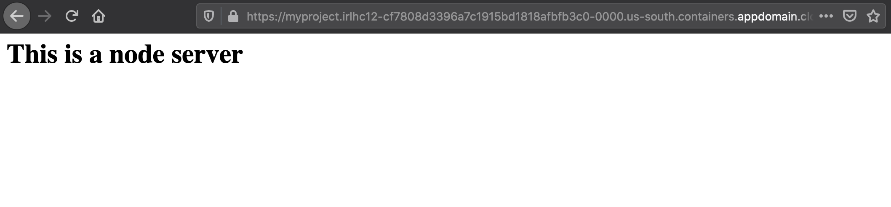

# Migrating and deploying Cloud Foundry applications to Kubernetes

## Description

This document takes us through the steps that will install Move2Kube and use Move2Kube's 3 step process (collect, plan and transform) to create deployment artifacts for Cloud Foundry apps. Here, we are going to use the data from [samples/cloud-foundry](https://github.com/konveyor/move2kube-demos/tree/main/samples/cloud-foundry).

### TLDR

```console
$ move2kube transform -s cloud-foundry
```

Move2Kube will automatically analyse all the artifacts in the cloud-foundry directory and transform and create all artifacts required for deploying the application in Kubernetes.

## Prerequisites

1. A source directory which contains the source code files and/or the manifest.yml file of a Cloud Foundry application.

   A sample of this is present in the [move2kube-demos](https://github.com/konveyor/move2kube-demos) repository. In this tutorial, we will be using the `cloud-foundry` sample from this repository.
    ```console
    $ curl https://move2kube.konveyor.io/scripts/download.sh | bash -s -- -d samples/cloud-foundry -r move2kube-demos
    ```

   Let's see the structure inside the `./cloud-foundry` directory. The `cloud-foundry` directory contains the source code files and the manifest.yml file.

   ```console
  $ tree cloud-foundry
  cloud-foundry/
  ├── cfnodejsapp
  │   ├── main.js
  │   ├── manifest.yml
  │   ├── package-lock.json
  │   └── package.json
  └── m2k_collect
      └── cf
          └── cfapps.yaml
   ```

1. Install [Move2Kube](/installation)

1. Install a container runtime: [Docker](https://www.docker.com/get-started) or [Podman](https://podman.io/getting-started/installation)

1. Install [Kubectl](https://kubernetes.io/docs/tasks/tools/install-kubectl)

   To verify that dependencies were correctly installed you can run the below commands.
   ```console
   $ move2kube version
   ```
   ```console
   $ docker version
   ```
   or
   ```console
   $ podman info
   ```
   ```console
   $ kubectl version
   ```

1. Install the [Cloud Foundry CLI](https://docs.cloudfoundry.org/cf-cli/install-go-cli.html)

1. To demonstrate how to use Move2Kube to migrate a Cloud Foundry (CF) application to Kubernetes, we will be using the source code inside the `cloud-foundry/cfnodejsapp` directory. If you want to try out Move2Kube on your CF application, then in place of our sample `cloud-foundry` directory, you should provide the correct path of the source directory (containing the source code and/or manifest files) of your CF application to Move2Kube during the *plan* phase.

1. Optional: We will deploy a simple nodejs application into CF. If you have a running CF app already you may use that instead. Provision a CF app with the name `cfnodejsapp` using your cloud provider (Ex: [IBM Cloud](https://cloud.ibm.com/)).
   1. Make note of the API endpoint (API endpoints for the IBM Cloud Foundry service can be found [here](https://cloud.ibm.com/docs/cloud-foundry-public?topic=cloud-foundry-public-endpoints)).
   1. Login to CF using
       ```console
       $ cf login -a <YOUR CF API endpoint>
       ```
   1. From the root directory of this repo run this to deploy the sample application
       ```console
       $ cf push -f ./cloud-foundry/
       ```
   1. You can visit the URL of the application (you can get this by running `cf apps`) to see it running.


## Steps to generate target artifacts

Now that we have a running CF app we can transform it using Move2Kube. We will be using the three stage process (*collect*, *plan* and *transform*) for the transformation. Run these steps from the directory where `cloud-foundry` directory is present:

1. Optional: This step is required only if you are interested in metadata such as environment variables from a running instance. If you don't have a running app, you can use the m2k_collect directoy that comes with the sample.
 We will first collect some data about your running CF application. Here we will limit the collect to only cloud foundry information using the `-a cf` annotation flag.  

    ```console
    $ cf login -a <YOUR CF API endpoint>
    $ move2kube collect -a cf
    INFO[0000] Begin collection                             
    INFO[0000] [*collector.CfAppsCollector] Begin collection 
    INFO[0013] [*collector.CfAppsCollector] Done            
    INFO[0013] [*collector.CfServicesCollector] Begin collection 
    INFO[0027] [*collector.CfServicesCollector] Done        
    INFO[0027] Collection done                              
    INFO[0027] Collect Output in [/Users/username/m2k_collect]. Copy this directory into the source directory to be used for planning.
    ```

    * The data we collected will be stored in a new directory called `./m2k_collect`.

    ```console
    $ ls m2k_collect
    cf
    ```

    * The `./m2k_collect/cf` directory contains the yaml file which has the runtime information of the particular application that you are trying to transform. There is information about the buildpacks that are supported, the memory, the number of instances and the ports that are supported. If there are environment variables, it collects that information too.

    * Move the `./m2k_collect/cf` directory into the source directory `./cloud-foundry`.

    ```console
    $ mv m2k_collect cloud-foundry/
    ```

2. Then we create a *plan* on how to transform your app to run on Kubernetes. In the *plan* phase, it is going to combine the runtime metadata (if present) with source artifacts and come up with a *plan* for us. Here, we provide to Move2Kube the path to the source directory (containing the source code and/or manifest files of CF application) using the `-s` flag.

    ```console
    $ move2kube plan -s cloud-foundry
    INFO[0000] Loading Configuration                        
    INFO[0000] [*configuration.ClusterMDLoader] Loading configuration 
    INFO[0000] [*configuration.ClusterMDLoader] Done        
    INFO[0000] Configuration loading done                   
    INFO[0000] Planning Transformation - Base Directory     
    INFO[0000] [DockerfileDetector] Planning transformation 
    INFO[0000] [DockerfileDetector] Done                    
    INFO[0000] [ComposeAnalyser] Planning transformation    
    INFO[0000] [ComposeAnalyser] Done                       
    INFO[0000] [ZuulAnalyser] Planning transformation       
    INFO[0000] [ZuulAnalyser] Done                          
    INFO[0000] [CloudFoundry] Planning transformation       
    INFO[0000] Identified 1 namedservices and 0 unnamed transformer plans 
    INFO[0000] [CloudFoundry] Done                          
    INFO[0000] [Base Directory] Identified 1 namedservices and 0 unnamed transformer plans 
    INFO[0000] Transformation planning - Base Directory done 
    INFO[0000] Planning Transformation - Directory Walk     
    INFO[0000] Identified 1 namedservices and 0 unnamed transformer plans in . 
    INFO[0000] Transformation planning - Directory Walk done 
    INFO[0000] [Directory Walk] Identified 1 namedservices and 0 unnamed transformer plans 
    INFO[0000] [Named Services] Identified 1 namedservices  
    INFO[0000] No of services identified : 1                
    INFO[0000] Plan can be found at [/Users/username/m2k.plan].
    ```

    * It has created a *m2k.plan* which is essentially a yaml file. Let's see what is inside the *plan* file.

    ```console
    $ cat m2k.plan
    ```
    <details markdown="block">
    <summary markdown="block">
    ```yaml
    # click to see the full plan yaml
    apiVersion: move2kube.konveyor.io/v1alpha1
    kind: Plan
    .......
    ```
    </summary>
    ```yaml
      apiVersion: move2kube.konveyor.io/v1alpha1
      kind: Plan
      metadata:
        name: myproject
      spec:
        sourceDir: cloud-foundry
        services:
          cfnodejsapp:
            - transformerName: CloudFoundry
              paths:
                CfManifest:
                  - cfnodejsapp/manifest.yml
                CfRunningManifest:
                  - m2k_collect/cf/cfapps.yaml
                ServiceDirPath:
                  - cfnodejsapp
              configs:
                CloudFoundryService:
                  serviceName: cfnodejsapp
                ContainerizationOptions:
                  - Nodejs-Dockerfile
            - transformerName: Nodejs-Dockerfile
              paths:
                ServiceDirPath:
                  - cfnodejsapp
        transformers:
          Buildconfig: m2kassets/built-in/transformers/kubernetes/buildconfig/buildconfig.yaml
          CloudFoundry: m2kassets/built-in/transformers/cloudfoundry/cloudfoundry.yaml
          ClusterSelector: m2kassets/built-in/transformers/kubernetes/clusterselector/clusterselector.yaml
          ComposeAnalyser: m2kassets/built-in/transformers/compose/composeanalyser/composeanalyser.yaml
          ComposeGenerator: m2kassets/built-in/transformers/compose/composegenerator/composegenerator.yaml
          ContainerImagesPushScriptGenerator: m2kassets/built-in/transformers/containerimage/containerimagespushscript/containerimagespushscript.yaml
          DockerfileDetector: m2kassets/built-in/transformers/dockerfile/dockerfiledetector/dockerfiledetector.yaml
          DockerfileImageBuildScript: m2kassets/built-in/transformers/dockerfile/dockerimagebuildscript/dockerfilebuildscriptgenerator.yaml
          DockerfileParser: m2kassets/built-in/transformers/dockerfile/dockerfileparser/dockerfileparser.yaml
          DotNetCore-Dockerfile: m2kassets/built-in/transformers/dockerfilegenerator/dotnetcore/dotnetcore.yaml
          EarAnalyser: m2kassets/built-in/transformers/dockerfilegenerator/java/earanalyser/ear.yaml
          EarRouter: m2kassets/built-in/transformers/dockerfilegenerator/java/earrouter/earrouter.yaml
          Golang-Dockerfile: m2kassets/built-in/transformers/dockerfilegenerator/golang/golang.yaml
          Gradle: m2kassets/built-in/transformers/dockerfilegenerator/java/gradle/gradle.yaml
          Jar: m2kassets/built-in/transformers/dockerfilegenerator/java/jar/jar.yaml
          Jboss: m2kassets/built-in/transformers/dockerfilegenerator/java/jboss/jboss.yaml
          Knative: m2kassets/built-in/transformers/kubernetes/knative/knative.yaml
          Kubernetes: m2kassets/built-in/transformers/kubernetes/kubernetes/kubernetes.yaml
          KubernetesVersionChanger: m2kassets/built-in/transformers/kubernetes/kubernetesversionchanger/kubernetesversionchanger.yaml
          Liberty: m2kassets/built-in/transformers/dockerfilegenerator/java/liberty/liberty.yaml
          Maven: m2kassets/built-in/transformers/dockerfilegenerator/java/maven/maven.yaml
          Nodejs-Dockerfile: m2kassets/built-in/transformers/dockerfilegenerator/nodejs/nodejs.yaml
          PHP-Dockerfile: m2kassets/built-in/transformers/dockerfilegenerator/php/php.yaml
          Parameterizer: m2kassets/built-in/transformers/kubernetes/parameterizer/parameterizer.yaml
          Python-Dockerfile: m2kassets/built-in/transformers/dockerfilegenerator/python/python.yaml
          ReadMeGenerator: m2kassets/built-in/transformers/readmegenerator/readmegenerator.yaml
          Ruby-Dockerfile: m2kassets/built-in/transformers/dockerfilegenerator/ruby/ruby.yaml
          Rust-Dockerfile: m2kassets/built-in/transformers/dockerfilegenerator/rust/rust.yaml
          Tekton: m2kassets/built-in/transformers/kubernetes/tekton/tekton.yaml
          Tomcat: m2kassets/built-in/transformers/dockerfilegenerator/java/tomcat/tomcat.yaml
          WarAnalyser: m2kassets/built-in/transformers/dockerfilegenerator/java/waranalyser/war.yaml
          WarRouter: m2kassets/built-in/transformers/dockerfilegenerator/java/warrouter/warrouter.yaml
          WinConsoleApp-Dockerfile: m2kassets/built-in/transformers/dockerfilegenerator/windows/winconsole/winconsole.yaml
          WinSLWebApp-Dockerfile: m2kassets/built-in/transformers/dockerfilegenerator/windows/winsilverlightweb/winsilverlightweb.yaml
          WinWebApp-Dockerfile: m2kassets/built-in/transformers/dockerfilegenerator/windows/winweb/winweb.yaml
          ZuulAnalyser: m2kassets/built-in/transformers/dockerfilegenerator/java/zuul/zuulanalyser.yaml
    ```
    </details>

    * In the plan, you can see that Move2Kube has detected the `cfnodejsapp` service, which is the name of our sample CF application from it's manifest.yml.
    * And the plan file is saying that the application can be transformed using two transformers `CloudFoundry` or `Nodejs-Dockerfile`.
    * It can use the source artifacts `manifest.yaml` and also the runtime information from `cfapps.yaml` and combine all of them and do the transformation. 

3. Let's invoke `move2kube transform` on this *plan*.

    ```console
    $ move2kube transform
    INFO[0000] Detected a plan file at path /Users/username/m2k.plan. Will transform using this plan. 
    ? Select all transformer types that you are interested in:
    Hints:
    [Services that don't support any of the transformer types you are interested in will be ignored.]
        [Use arrows to move, space to select, <right> to all, <left> to none, type to filter]
      > [✓]  Jboss
        [✓]  Kubernetes
        [✓]  Liberty
        [✓]  ZuulAnalyser
        [✓]  CloudFoundry
        [✓]  DockerfileParser
        [✓]  Golang-Dockerfile
        [✓]  Gradle
        [✓]  Python-Dockerfile
        [✓]  ReadMeGenerator
        [✓]  ContainerImagesPushScriptGenerator
        [✓]  DotNetCore-Dockerfile
        [✓]  Parameterizer
        [✓]  Tekton
        [✓]  WinSLWebApp-Dockerfile
        [✓]  Buildconfig
        [✓]  ClusterSelector
        [✓]  ComposeAnalyser
        [✓]  PHP-Dockerfile
        [✓]  Ruby-Dockerfile
        [✓]  WinConsoleApp-Dockerfile
        [✓]  DockerfileImageBuildScript
        [✓]  EarRouter
        [✓]  Rust-Dockerfile
        [✓]  Tomcat
        [✓]  WarAnalyser
        [✓]  EarAnalyser
        [✓]  Knative
        [✓]  Maven
        [✓]  WinWebApp-Dockerfile
        [✓]  ComposeGenerator
        [✓]  Jar
        [✓]  DockerfileDetector
        [✓]  KubernetesVersionChanger
        [✓]  Nodejs-Dockerfile
        [✓]  WarRouter
    ```

    * Let's go ahead with the default answer by pressing `return` or `enter` key.

    ```console
    Jboss, Kubernetes, Liberty, ZuulAnalyser, CloudFoundry, DockerfileParser, Golang-Dockerfile, Gradle, Python-Dockerfile, ReadMeGenerator, ContainerImagesPushScriptGenerator, DotNetCore-Dockerfile, Parameterizer, Tekton, WinSLWebApp-Dockerfile, Buildconfig, ClusterSelector, ComposeAnalyser, PHP-Dockerfile, Ruby-Dockerfile, WinConsoleApp-Dockerfile, DockerfileImageBuildScript, EarRouter, Rust-Dockerfile, Tomcat, WarAnalyser, EarAnalyser, Knative, Maven, WinWebApp-Dockerfile, ComposeGenerator, Jar, DockerfileDetector, KubernetesVersionChanger, Nodejs-Dockerfile, WarRouter
    ? Select all services that are needed:
    Hints:
    [The services unselected here will be ignored.]
    [Use arrows to move, space to select, <right> to all, <left> to none, type to filter]
    > [✓]  cfnodejsapp
    ```

    * Here, we go ahead with the `cfnodejsapp` service.

    ```console
     cfnodejsapp
    INFO[0275] Starting Plan Transformation                 
    INFO[0275] Iteration 1                                  
    INFO[0275] Iteration 2 - 1 artifacts to process         
    INFO[0275] Transformer CloudFoundry processing 1 artifacts 
    INFO[0275] Transformer ZuulAnalyser processing 2 artifacts 
    INFO[0275] Transformer ZuulAnalyser Done                
    INFO[0275] Transformer CloudFoundry Done                
    INFO[0275] Created 0 pathMappings and 3 artifacts. Total Path Mappings : 0. Total Artifacts : 1. 
    INFO[0275] Iteration 3 - 3 artifacts to process         
    INFO[0275] Transformer ClusterSelector processing 2 artifacts 

    ? Choose the cluster type:
    Hints:
    [Choose the cluster type you would like to target]
      [Use arrows to move, type to filter]
    > Kubernetes
      Openshift
      AWS-EKS
      Azure-AKS
      GCP-GKE
      IBM-IKS
      IBM-Openshift
    ```

    * Now, it asks to select the cluster type you want to deploy to. Here, we select the `Kubernetes` cluster type.

    ```console
    Kubernetes
    INFO[0351] Transformer ClusterSelector Done             
    INFO[0351] Transformer Kubernetes processing 2 artifacts 

    ? What URL/path should we expose the service cfnodejsapp's 8080 port on?
    Hints:
    [Enter :- not expose the service, Leave out leading / to use first part as subdomain, Add :N as suffix for NodePort service type, Add :L for Load Balancer service type]
     (/cfnodejsapp)
    ```

    * Let's go ahead with the default answer by pressing `return` or `enter` key.

    ```console
    /cfnodejsapp
    ? Provide the minimum number of replicas each service should have
    Hints:
    [If the value is 0 pods won't be started by default]
      (2)
    ```

    * Let's go ahead with the default answer again, which means 2 replicas for each service.

    ```console
    2
    ? Enter the URL of the image registry : 
    Hints:
    [You can always change it later by changing the yamls.]
      [Use arrows to move, type to filter]
      Other (specify custom option)
      index.docker.io
    > quay.io
      us.icr.io
    ```

    * Then it asks to select the registry where your images are hosted. Here, we are selecting `quay.io`. Select 'Other' if your registry name is not here.

    ```console
    quay.io
    ? Enter the namespace where the new images should be pushed :  
    Hints:
     [Ex : myproject]
     (myproject) m2k-tutorial
    ```

    * Input the namespace under which you want to deploy- m2k-tutorial. (Say, you have namespace `m2k-tutorial` in quay.io)

    ```console
    m2k-tutorial
    ? [quay.io] What type of container registry login do you want to use?
    Hints:
     [Docker login from config mode, will use the default config from your local machine.]
      [Use arrows to move, type to filter]
      Use existing pull secret
    > No authentication
      UserName/Password
    ```

    * Select the container registry login type.

    ```console
    No authentication
    INFO[0841] Optimization done                            
    INFO[0841] Begin Optimization                           
    INFO[0841] Optimization done                            
    INFO[0841] Created 2 pathMappings and 2 artifacts. Total Path Mappings : 2. Total Artifacts : 3. 
    INFO[0841] Transformer Knative Done                     
    INFO[0841] Transformer Tekton processing 2 artifacts    
    INFO[0841] Begin Optimization                           
    INFO[0841] Optimization done                            
    INFO[0841] Generating Tekton pipeline for CI/CD         
    INFO[0841] No remote git repos detected. You might want to configure the git repository links manually.
    ? Provide the ingress host domain
    Hints:
     [Ingress host domain is part of service URL]
     (myproject.com) my-cluster-ingress-host-domain.com
    ```

    * It is now asking for the ingress hosting domain. It can be grabbed from the cluster you are going to deploy to. The ingress hosting domain will differ based on the cluster you are fetching from.

    ```console
    ? Provide the TLS secret for ingress
    Hints:
     [Leave empty to use http]

    ```

    * Then it asks information about your TLS secret. Here we go with the by-default by pressing the 'return' key.

    ```console

    INFO[1094] Begin Optimization                           
    INFO[1094] Optimization done                            
    INFO[1094] Generating Tekton pipeline for CI/CD         
    INFO[1094] No remote git repos detected. You might want to configure the git repository links manually. 
    INFO[1094] Created 20 pathMappings and 2 artifacts. Total Path Mappings : 22. Total Artifacts : 3. 
    INFO[1094] Transformer Tekton Done                      
    INFO[1094] Transformer Buildconfig processing 2 artifacts 
    INFO[1094] Begin Optimization                           
    INFO[1094] Optimization done                            
    INFO[1094] Created 0 pathMappings and 0 artifacts. Total Path Mappings : 22. Total Artifacts : 3. 
    INFO[1094] Transformer Buildconfig Done                 
    INFO[1094] Transformer ComposeGenerator processing 2 artifacts 
    INFO[1094] Begin Optimization                           
    INFO[1094] Optimization done                            
    INFO[1094] Begin Optimization                           
    INFO[1094] Optimization done                            
    INFO[1094] Created 2 pathMappings and 0 artifacts. Total Path Mappings : 24. Total Artifacts : 3. 
    INFO[1094] Transformer ComposeGenerator Done            
    INFO[1094] Transformer Kubernetes processing 2 artifacts 
    INFO[1094] Begin Optimization                           
    INFO[1094] Optimization done                            
    INFO[1094] Total transformed objects : 3                
    INFO[1094] Begin Optimization                           
    INFO[1094] Optimization done                            
    INFO[1094] Total transformed objects : 3                
    INFO[1094] Created 2 pathMappings and 2 artifacts. Total Path Mappings : 26. Total Artifacts : 3. 
    INFO[1094] Transformer Kubernetes Done                  
    INFO[1094] Transformer Nodejs-Dockerfile processing 1 artifacts
    ? Select port to be exposed for the service cfnodejsapp :
    Hints:
    [Select Other if you want to expose the service cfnodejsapp to some other port]
      [Use arrows to move, type to filter]
    > 8080
      Other (specify custom option)
    ```

    * Select the port on which you want to expose the `cfnodejsapp` service.

    ```console
    8080
    INFO[1184] Created 2 pathMappings and 2 artifacts. Total Path Mappings : 28. Total Artifacts : 3. 
    INFO[1184] Transformer Nodejs-Dockerfile Done           
    INFO[1184] Iteration 4                                  
    INFO[1184] Transformer ReadMeGenerator processing 4 artifacts 
    INFO[1184] Created 1 pathMappings and 0 artifacts. Total Path Mappings : 29. Total Artifacts : 11. 
    INFO[1184] Transformer ReadMeGenerator Done             
    INFO[1184] Transformer DockerfileImageBuildScript processing 2 artifacts 

    ? Select the container runtime to use :
    Hints:
    [The container runtime selected will be used in the scripts]
      [Use arrows to move, type to filter]
    > docker
      podman
    ```

    * Select the container runtime you want to use.

    ```console
     docker
    INFO[1184] Created 1 pathMappings and 2 artifacts. Total Path Mappings : 30. Total Artifacts : 11. 
    INFO[1184] Transformer DockerfileImageBuildScript Done  
    INFO[1184] Transformer DockerfileParser processing 1 artifacts 
    INFO[1184] Created 0 pathMappings and 1 artifacts. Total Path Mappings : 30. Total Artifacts : 11. 
    INFO[1184] Transformer DockerfileParser Done            
    INFO[1184] Transformer Parameterizer processing 4 artifacts 
    INFO[1184] Created 12 pathMappings and 0 artifacts. Total Path Mappings : 42. Total Artifacts : 11. 
    INFO[1184] Transformer Parameterizer Done               
    INFO[1184] Iteration 5                                  
    INFO[1184] Transformer Tekton processing 2 artifacts    
    INFO[1184] Begin Optimization                           
    INFO[1184] Optimization done                            
    INFO[1184] Generating Tekton pipeline for CI/CD         
    INFO[1184] No remote git repos detected. You might want to configure the git repository links manually. 
    INFO[1184] Begin Optimization                           
    INFO[1184] Optimization done                            
    INFO[1184] Generating Tekton pipeline for CI/CD         
    INFO[1184] No remote git repos detected. You might want to configure the git repository links manually. 
    INFO[1184] Created 20 pathMappings and 2 artifacts. Total Path Mappings : 62. Total Artifacts : 14. 
    INFO[1184] Transformer Tekton Done                      
    INFO[1184] Transformer Buildconfig processing 2 artifacts 
    INFO[1184] Begin Optimization                           
    INFO[1185] Optimization done                            
    INFO[1185] Created 0 pathMappings and 0 artifacts. Total Path Mappings : 62. Total Artifacts : 14. 
    INFO[1185] Transformer Buildconfig Done                 
    INFO[1185] Transformer ComposeGenerator processing 2 artifacts 
    INFO[1185] Begin Optimization                           
    INFO[1185] Optimization done                            
    INFO[1185] Begin Optimization                           
    INFO[1185] Optimization done                            
    INFO[1185] Created 2 pathMappings and 0 artifacts. Total Path Mappings : 64. Total Artifacts : 14. 
    INFO[1185] Transformer ComposeGenerator Done            
    INFO[1185] Transformer ContainerImagesPushScriptGenerator processing 2 artifacts 
    INFO[1185] Created 1 pathMappings and 1 artifacts. Total Path Mappings : 65. Total Artifacts : 14. 
    INFO[1185] Transformer ContainerImagesPushScriptGenerator Done 
    INFO[1185] Transformer Kubernetes processing 2 artifacts 
    INFO[1185] Begin Optimization                           
    INFO[1185] Optimization done                            
    INFO[1185] Total transformed objects : 3                
    INFO[1185] Begin Optimization                           
    INFO[1185] Optimization done                            
    INFO[1185] Total transformed objects : 3                
    INFO[1185] Created 2 pathMappings and 2 artifacts. Total Path Mappings : 67. Total Artifacts : 14. 
    INFO[1185] Transformer Kubernetes Done                  
    INFO[1185] Transformer ContainerImagesBuildScriptGenerator processing 2 artifacts 
    INFO[1185] Created 2 pathMappings and 1 artifacts. Total Path Mappings : 69. Total Artifacts : 14. 
    INFO[1185] Transformer ContainerImagesBuildScriptGenerator Done 
    INFO[1185] Transformer Knative processing 2 artifacts   
    INFO[1185] Begin Optimization                           
    INFO[1185] Optimization done                            
    INFO[1185] Begin Optimization                           
    INFO[1185] Optimization done                            
    INFO[1185] Created 2 pathMappings and 2 artifacts. Total Path Mappings : 71. Total Artifacts : 14. 
    INFO[1185] Transformer Knative Done                     
    INFO[1185] Iteration 6                                  
    INFO[1185] Transformer Parameterizer processing 4 artifacts 
    INFO[1185] Created 12 pathMappings and 0 artifacts. Total Path Mappings : 83. Total Artifacts : 22. 
    INFO[1185] Transformer Parameterizer Done               
    INFO[1185] Transformer ReadMeGenerator processing 6 artifacts 
    INFO[1185] Created 1 pathMappings and 0 artifacts. Total Path Mappings : 84. Total Artifacts : 22. 
    INFO[1185] Transformer ReadMeGenerator Done             
    INFO[1185] Plan Transformation done                     
    INFO[1185] Transformed target artifacts can be found at [/Users/username/github/move2kube-demos/samples/myproject].
    ```

Finally, the transformation is successful and the target artifacts can be found inside the `./myproject` directory. The structure of the *./myproject* directory can be seen by executing the below command.

<details markdown="block">
<summary markdown="block">
```console
# click to see the output
$  tree myproject
```

</summary>

```console
$  tree myproject
myproject/
├── Readme.md
├── deploy
│   ├── cicd
│   │   ├── tekton
│   │   │   ├── cfnodejsapp-vcapasenv-secret.yaml
│   │   │   ├── myproject-clone-build-push-pipeline.yaml
│   │   │   ├── myproject-clone-push-serviceaccount.yaml
│   │   │   ├── myproject-git-event-triggerbinding.yaml
│   │   │   ├── myproject-git-repo-eventlistener.yaml
│   │   │   ├── myproject-image-registry-secret.yaml
│   │   │   ├── myproject-ingress.yaml
│   │   │   ├── myproject-run-clone-build-push-triggertemplate.yaml
│   │   │   ├── myproject-tekton-triggers-admin-role.yaml
│   │   │   ├── myproject-tekton-triggers-admin-rolebinding.yaml
│   │   │   └── myproject-tekton-triggers-admin-serviceaccount.yaml
│   │   └── tekton-parameterized
│   │       ├── helm-chart
│   │       │   └── myproject
│   │       │       ├── Chart.yaml
│   │       │       └── templates
│   │       │           ├── cfnodejsapp-vcapasenv-secret.yaml
│   │       │           ├── myproject-clone-build-push-pipeline.yaml
│   │       │           ├── myproject-clone-push-serviceaccount.yaml
│   │       │           ├── myproject-git-event-triggerbinding.yaml
│   │       │           ├── myproject-git-repo-eventlistener.yaml
│   │       │           ├── myproject-image-registry-secret.yaml
│   │       │           ├── myproject-ingress.yaml
│   │       │           ├── myproject-run-clone-build-push-triggertemplate.yaml
│   │       │           ├── myproject-tekton-triggers-admin-role.yaml
│   │       │           ├── myproject-tekton-triggers-admin-rolebinding.yaml
│   │       │           └── myproject-tekton-triggers-admin-serviceaccount.yaml
│   │       ├── kustomize
│   │       │   └── base
│   │       │       ├── cfnodejsapp-vcapasenv-secret.yaml
│   │       │       ├── kustomization.yaml
│   │       │       ├── myproject-clone-build-push-pipeline.yaml
│   │       │       ├── myproject-clone-push-serviceaccount.yaml
│   │       │       ├── myproject-git-event-triggerbinding.yaml
│   │       │       ├── myproject-git-repo-eventlistener.yaml
│   │       │       ├── myproject-image-registry-secret.yaml
│   │       │       ├── myproject-ingress.yaml
│   │       │       ├── myproject-run-clone-build-push-triggertemplate.yaml
│   │       │       ├── myproject-tekton-triggers-admin-role.yaml
│   │       │       ├── myproject-tekton-triggers-admin-rolebinding.yaml
│   │       │       └── myproject-tekton-triggers-admin-serviceaccount.yaml
│   │       └── openshift-template
│   │           └── template.yaml
│   ├── compose
│   │   └── docker-compose.yaml
│   ├── knative
│   │   └── cfnodejsapp-service.yaml
│   ├── knative-parameterized
│   │   ├── helm-chart
│   │   │   └── myproject
│   │   │       ├── Chart.yaml
│   │   │       └── templates
│   │   │           └── cfnodejsapp-service.yaml
│   │   ├── kustomize
│   │   │   └── base
│   │   │       ├── cfnodejsapp-service.yaml
│   │   │       └── kustomization.yaml
│   │   └── openshift-template
│   │       └── template.yaml
│   ├── yamls
│   │   ├── cfnodejsapp-deployment.yaml
│   │   ├── cfnodejsapp-service.yaml
│   │   ├── cfnodejsapp-vcapasenv-secret.yaml
│   │   └── myproject-ingress.yaml
│   └── yamls-parameterized
│       ├── helm-chart
│       │   └── myproject
│       │       ├── Chart.yaml
│       │       ├── templates
│       │       │   ├── cfnodejsapp-deployment.yaml
│       │       │   ├── cfnodejsapp-service.yaml
│       │       │   ├── cfnodejsapp-vcapasenv-secret.yaml
│       │       │   └── myproject-ingress.yaml
│       │       ├── values-dev.yaml
│       │       ├── values-prod.yaml
│       │       └── values-staging.yaml
│       ├── kustomize
│       │   ├── base
│       │   │   ├── cfnodejsapp-deployment.yaml
│       │   │   ├── cfnodejsapp-service.yaml
│       │   │   ├── cfnodejsapp-vcapasenv-secret.yaml
│       │   │   ├── kustomization.yaml
│       │   │   └── myproject-ingress.yaml
│       │   └── overlays
│       │       ├── dev
│       │       │   ├── apps-v1-deployment-cfnodejsapp.yaml
│       │       │   └── kustomization.yaml
│       │       ├── prod
│       │       │   ├── apps-v1-deployment-cfnodejsapp.yaml
│       │       │   └── kustomization.yaml
│       │       └── staging
│       │           ├── apps-v1-deployment-cfnodejsapp.yaml
│       │           └── kustomization.yaml
│       └── openshift-template
│           ├── parameters-dev.yaml
│           ├── parameters-prod.yaml
│           ├── parameters-staging.yaml
│           └── template.yaml
├── scripts
│   ├── builddockerimages.bat
│   ├── builddockerimages.sh
│   ├── pushimages.bat
│   └── pushimages.sh
└── source
    ├── cfnodejsapp
    │   ├── Dockerfile
    │   ├── main.js
    │   ├── manifest.yml
    │   ├── package-lock.json
    │   └── package.json
    └── m2k_collect
        └── cf
            └── cfapps.yaml
```
</details>

So, Move2Kube has created all the deployment artifacts which are present inside the *./myproject* directory.

## Deploying the application to Kubernetes with the generated target artifacts

1. Let's get inside the *./myproject* directory.

     ```console
     $ cd myproject/

     $ ls
     Readme.md deploy    scripts   source
     ```


2. Next we run the *builddockerimages.sh* script inside the `./myproject/scripts` directory. This step may take some time to complete.

    ```console
    $ cd scripts
    ```

    ```console
    $ ./builddockerimages.sh
    [+] Building 7.1s (8/8) FINISHED                             
    => [internal] load build definition from Dockerfile    0.1s
    => => transferring dockerfile: 37B                     0.0s
    => [internal] load .dockerignore                       0.0s
    => => transferring context: 2B                         0.0s
    => [internal] load metadata for registry.access.redha  2.7s
    => [internal] load build context                       0.0s
    => => transferring context: 354B                       0.0s
    => CACHED [1/3] FROM registry.access.redhat.com/ubi8/  0.0s
    => [2/3] COPY . .                                      0.1s
    => [3/3] RUN npm install                               4.0s
    => exporting to image                                  0.1s
    => => exporting layers                                 0.0s
    => => writing image sha256:7bd59bff8763073644bd68cd3f  0.0s
    => => naming to docker.io/library/cfnodejsapp          0.0s
    /Users/username/github/move2kube-demos/samples/myproject
    done
    ```


3. Now using the *pushimages.sh* script we can push our applications images to the registry that we specified during the *transform* phase. For this step, you are required to log in to your Docker registry. To log in to `quay.io` run `docker login quay.io`. To log in to IBM Cloud `us.icr.io` registry refer [here](https://cloud.ibm.com/docs/Registry?topic=Registry-registry_access#registry_access_apikey_auth_docker).

    ```console
    $ ./pushimages.sh
    Using default tag: latest
    The push refers to repository [quay.io/m2k-tutorial/cfnodejsapp]
    d98785f949ff: Layer already exists 
    2234a0b938d7: Layer already exists 
    967d006c4be4: Layer already exists 
    90c628b74ee4: Layer already exists 
    e7f8a4365a01: Layer already exists 
    a7be0896acef: Layer already exists 
    73eb3b4bebc5: Layer already exists 
    latest: digest: sha256:75283b09042b1454567b5e99d6d99374daad07fe46ee6843ace7dca29f085fd7 size: 1789
    ```

    NOTE: If you have pushed the image repository to `quay.io`, then in the Repository's Visibility in [quay.io](https://quay.io) `cfnodejsapp` repository's Settings, select whether you want the repository `cfnodejsapp` to be public or private so that it can be properly accessed by the Kubernetes cluster.


4. Finally we are going to deploy the application with *kubectl apply* command using the yaml files which Move2Kube has created for us inside the `./myproject/deploy/yamls` directory.

    ```console
    $ cd ..

    $ kubectl apply -f deploy/yamls
    deployment.apps/cfnodejsapp created
    service/cfnodejsapp created
    ingress.networking.k8s.io/myproject created
    ```

    Now our application is accessible on the cluster. You can check the status of pods by running the command mentioned below.

    ```console
    $ kubectl get pods

    NAME                           READY   STATUS    RESTARTS   AGE
    cfnodejsapp-58d777bd44-8ct2m   1/1     Running   0          7s
    cfnodejsapp-58d777bd44-hq6lf   1/1     Running   0          7s
    ```

    We can get the ingress to see the URL where the app has been deployed to.

    ```console
    $ kubectl get ingress myproject
    ```

    cfnodejsapp
    

## Conclusion

So, that is a simple way where you were able to combine multiple information like runtime information, source information and cluster information, and do a holistic transformation of your Cloud Foundry app to Kubernetes.
