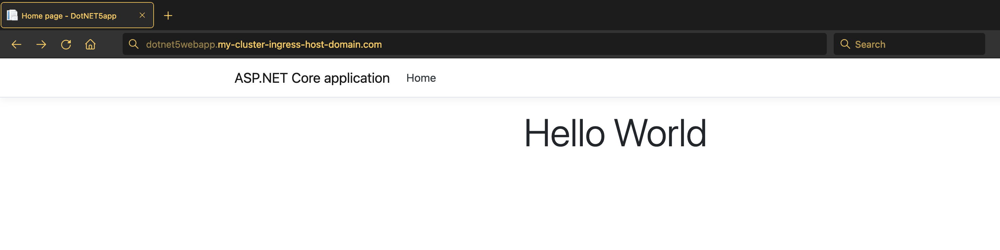
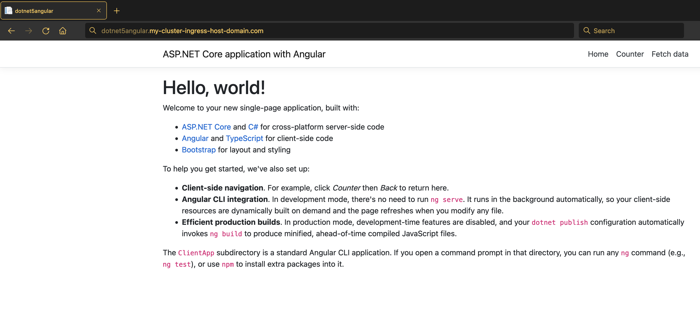
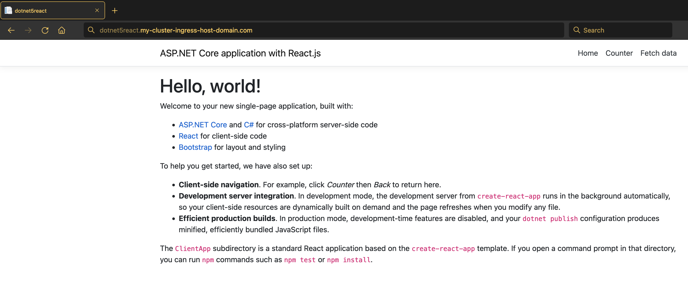
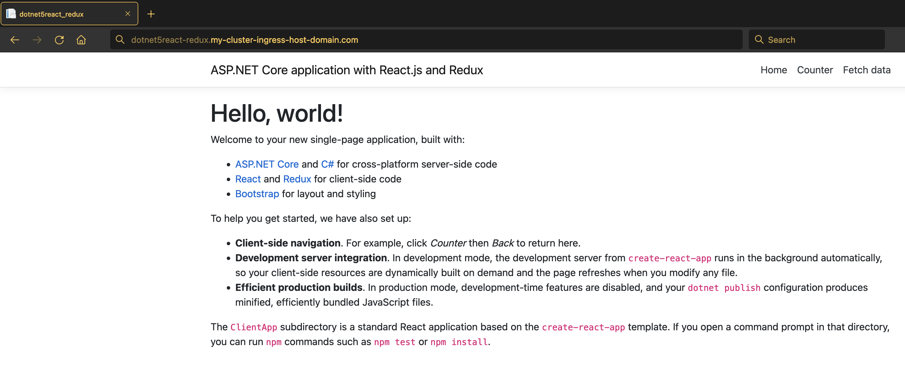

# Migrating and deploying .NET Core applications to Kubernetes

## Description

In this tutorial, we will learn how to migrate and deploy .NET Core applications to Kubernetes cluster using Move2Kube. We will use the target artifacts generated by Move2Kube to deploy the applications to a Kubernetes cluster. Here, we are going to use the data from [samples/dotnet5](https://github.com/konveyor/move2kube-demos/tree/main/samples/dotnet5).

## Prerequisites

1. Install [Move2Kube](/installation)

1. Install a container runtime: [Docker](https://www.docker.com/get-started) or [Podman](https://podman.io/getting-started/installation)

1. Install [Kubectl](https://kubernetes.io/docs/tasks/tools/install-kubectl)

   To verify that dependencies were correctly installed you can run the below commands.
   ```console
   $ docker version
   ```
   or
   ```console
   $ podman info
   ```
   ```console
   $ kubectl version
   ```

1. Download the `samples/dotnet5` sample from [move2kube-demos](https://github.com/konveyor/move2kube-demos) repository

    ```console
    $ curl https://move2kube.konveyor.io/scripts/download.sh | bash -s -- -d samples/dotnet5 -r move2kube-demos
    ```
   Let's see the structure inside the `./dotnet5` directory. It has four different applications-
     * `dotnetwebapp` - an ASP.NET Core web application.
     * `dotnetangular` - an ASP.NET Core application with Angular for client-side code.
     * `dotnetreact` - an ASP.NET Core application with React for client-side code.
     * `dotnetreact-redux` - an ASP.NET Core application with React and Redux for client-side code.

   ```console
   $ tree dotnet5 -L 2
   dotnet5
   ├── dotnet5angular
   │   ├── ClientApp
   │   ├── Controllers
   │   ├── Pages
   │   ├── Program.cs
   │   ├── Properties
   │   ├── Startup.cs
   │   ├── WeatherForecast.cs
   │   ├── appsettings.Development.json
   │   ├── appsettings.json
   │   ├── dotnet5angular.csproj
   │   ├── dotnet5angular.sln
   │   └── wwwroot
   ├── dotnet5react
   │   ├── ClientApp
   │   ├── Controllers
   │   ├── Pages
   │   ├── Program.cs
   │   ├── Properties
   │   ├── Startup.cs
   │   ├── WeatherForecast.cs
   │   ├── appsettings.Development.json
   │   ├── appsettings.json
   │   ├── dotnet5react.csproj
   │   ├── dotnet5react.sln
   │   ├── log.cs
   │   └── obj
   ├── dotnet5react-redux
   │   ├── ClientApp
   │   ├── Controllers
   │   ├── Pages
   │   ├── Program.cs
   │   ├── Properties
   │   ├── Startup.cs
   │   ├── WeatherForecast.cs
   │   ├── appsettings.Development.json
   │   ├── appsettings.json
   │   ├── dotnet5react-redux.csproj
   │   └── dotnet5react-redux.sln
   └── dotnet5webapp
       ├── Pages
       ├── Program.cs
       ├── Properties
       ├── Startup.cs
       ├── appsettings.Development.json
       ├── appsettings.json
       ├── dotnet5webapp.csproj
       ├── dotnet5webapp.sln
       └── wwwroot

   21 directories, 28 files
   ```

## Steps to generate target artifacts

We will be using the two stage process (*plan* and *transform*) for the transformation. Run these steps from the directory containing the `./dotnet5/` directory:

1. First we create a *plan* on how to transform the applications to run on Kubernetes. In the *plan* phase, Move2Kube is going to go through the source artifacts and going to come up with a *plan* for us.

    ```console
    $ cd samples
    ```

    ```console
    $ move2kube plan -s dotnet5
    INFO[0000] Configuration loading done                   
    INFO[0000] Planning Transformation - Base Directory     
    INFO[0000] [DockerfileDetector] Planning transformation 
    INFO[0000] [DockerfileDetector] Done                    
    INFO[0000] [CloudFoundry] Planning transformation       
    INFO[0000] [CloudFoundry] Done                          
    INFO[0000] [ComposeAnalyser] Planning transformation    
    INFO[0000] [ComposeAnalyser] Done                       
    INFO[0000] [Base Directory] Identified 0 named services and 0 to-be-named services 
    INFO[0000] Transformation planning - Base Directory done 
    INFO[0000] Planning Transformation - Directory Walk     
    INFO[0000] Identified 1 named services and 0 to-be-named services in dotnet5angular 
    INFO[0000] Identified 1 named services and 0 to-be-named services in dotnet5react 
    INFO[0000] Identified 1 named services and 0 to-be-named services in dotnet5react-redux 
    INFO[0000] Identified 1 named services and 0 to-be-named services in dotnet5webapp 
    INFO[0000] Transformation planning - Directory Walk done 
    INFO[0000] [Directory Walk] Identified 4 named services and 0 to-be-named services 
    INFO[0000] [Named Services] Identified 4 named services 
    INFO[0000] No of services identified : 4                
    INFO[0000] Plan can be found at [/Users/user/github/move2kube-demos/samples/m2k.plan].
    ```

    * It has created a *m2k.plan* which is essentially a yaml file. Let's see what is inside the *plan* file.

    ```console
    apiVersion: move2kube.konveyor.io/v1alpha1
    kind: Plan
    metadata:
      name: myproject
    spec:
      sourceDir: dotnet5
      services:
        dotnet5angular:
          - transformerName: DotNetCore-Dockerfile
            paths:
              DotNetCoreCsprojPathType:
                - dotnet5angular/dotnet5angular.csproj
              DotNetCoreSolutionPathType:
                - dotnet5angular/dotnet5angular.sln
              ServiceDirPath:
                - dotnet5angular
        dotnet5react:
          - transformerName: DotNetCore-Dockerfile
            paths:
              DotNetCoreCsprojPathType:
                - dotnet5react/dotnet5react.csproj
              DotNetCoreSolutionPathType:
                - dotnet5react/dotnet5react.sln
              ServiceDirPath:
                - dotnet5react
        dotnet5react-redux:
          - transformerName: DotNetCore-Dockerfile
            paths:
              DotNetCoreCsprojPathType:
                - dotnet5react-redux/dotnet5react-redux.csproj
              DotNetCoreSolutionPathType:
                - dotnet5react-redux/dotnet5react-redux.sln
              ServiceDirPath:
                - dotnet5react-redux
        dotnet5webapp:
          - transformerName: DotNetCore-Dockerfile
            paths:
              DotNetCoreCsprojPathType:
                - dotnet5webapp/dotnet5webapp.csproj
              DotNetCoreSolutionPathType:
                - dotnet5webapp/dotnet5webapp.sln
              ServiceDirPath:
                - dotnet5webapp
      transformers:
        Buildconfig: m2kassets/inbuilt/transformers/kubernetes/buildconfig/buildconfig.yaml
        CloudFoundry: m2kassets/inbuilt/transformers/cloudfoundry/cloudfoundry.yaml
        ClusterSelector: m2kassets/inbuilt/transformers/kubernetes/clusterselector/clusterselector.yaml
        ComposeAnalyser: m2kassets/inbuilt/transformers/compose/composeanalyser/composeanalyser.yaml
        ComposeGenerator: m2kassets/inbuilt/transformers/compose/composegenerator/composegenerator.yaml
        ContainerImagesPushScriptGenerator: m2kassets/inbuilt/transformers/containerimage/containerimagespushscript/containerimagespushscript.yaml
        DockerfileDetector: m2kassets/inbuilt/transformers/dockerfile/dockerfiledetector/dockerfiledetector.yaml
        DockerfileImageBuildScript: m2kassets/inbuilt/transformers/dockerfile/dockerimagebuildscript/dockerfilebuildscriptgenerator.yaml
        DockerfileParser: m2kassets/inbuilt/transformers/dockerfile/dockerfileparser/dockerfileparser.yaml
        DotNetCore-Dockerfile: m2kassets/inbuilt/transformers/dockerfilegenerator/dotnetcore/dotnetcore.yaml
        EarAnalyser: m2kassets/inbuilt/transformers/dockerfilegenerator/java/earanalyser/ear.yaml
        EarRouter: m2kassets/inbuilt/transformers/dockerfilegenerator/java/earrouter/earrouter.yaml
        Golang-Dockerfile: m2kassets/inbuilt/transformers/dockerfilegenerator/golang/golang.yaml
        Gradle: m2kassets/inbuilt/transformers/dockerfilegenerator/java/gradle/gradle.yaml
        Jar: m2kassets/inbuilt/transformers/dockerfilegenerator/java/jar/jar.yaml
        Jboss: m2kassets/inbuilt/transformers/dockerfilegenerator/java/jboss/jboss.yaml
        Knative: m2kassets/inbuilt/transformers/kubernetes/knative/knative.yaml
        Kubernetes: m2kassets/inbuilt/transformers/kubernetes/kubernetes/kubernetes.yaml
        KubernetesVersionChanger: m2kassets/inbuilt/transformers/kubernetes/kubernetesversionchanger/kubernetesversionchanger.yaml
        Liberty: m2kassets/inbuilt/transformers/dockerfilegenerator/java/liberty/liberty.yaml
        Maven: m2kassets/inbuilt/transformers/dockerfilegenerator/java/maven/maven.yaml
        Nodejs-Dockerfile: m2kassets/inbuilt/transformers/dockerfilegenerator/nodejs/nodejs.yaml
        PHP-Dockerfile: m2kassets/inbuilt/transformers/dockerfilegenerator/php/php.yaml
        Parameterizer: m2kassets/inbuilt/transformers/kubernetes/parameterizer/parameterizer.yaml
        Python-Dockerfile: m2kassets/inbuilt/transformers/dockerfilegenerator/python/python.yaml
        ReadMeGenerator: m2kassets/inbuilt/transformers/readmegenerator/readmegenerator.yaml
        Ruby-Dockerfile: m2kassets/inbuilt/transformers/dockerfilegenerator/ruby/ruby.yaml
        Rust-Dockerfile: m2kassets/inbuilt/transformers/dockerfilegenerator/rust/rust.yaml
        Tekton: m2kassets/inbuilt/transformers/kubernetes/tekton/tekton.yaml
        Tomcat: m2kassets/inbuilt/transformers/dockerfilegenerator/java/tomcat/tomcat.yaml
        WarAnalyser: m2kassets/inbuilt/transformers/dockerfilegenerator/java/waranalyser/war.yaml
        WarRouter: m2kassets/inbuilt/transformers/dockerfilegenerator/java/warrouter/warrouter.yaml
        WinConsoleApp-Dockerfile: m2kassets/inbuilt/transformers/dockerfilegenerator/windows/winconsole/winconsole.yaml
        WinSLWebApp-Dockerfile: m2kassets/inbuilt/transformers/dockerfilegenerator/windows/winsilverlightweb/winsilverlightweb.yaml
        WinWebApp-Dockerfile: m2kassets/inbuilt/transformers/dockerfilegenerator/windows/winweb/winweb.yaml
        ZuulAnalyser: m2kassets/inbuilt/transformers/dockerfilegenerator/java/zuul/zuulanalyser.yaml
    ```

    * In the *plan*, you can see that Move2Kube has detected all the four services (`dotnet5webapp`, `dotnet5angular`, `dotnet5react-redux`, `dotnet5react`) and relative paths of the detected `.csproj` and/or `.sln` files for each of the services.
    * Also, the *plan* file is saying that the applications can be transformed using Move2Kube's inbuilt `DotNetCore-Dockerfile` transformer.

2. Let's invoke `move2kube transform` on this *plan*.

    ```console
    $ move2kube transform
    INFO[0000] Detected a plan file at path /Users/username/github/move2kube-demos/samples/m2k.plan. Will transform using this plan. 
    ? Select all transformer types that you are interested in:
    Hints:
    [Services that don't support any of the transformer types you are interested in will be ignored.]
        [Use arrows to move, space to select, <right> to all, <left> to none, type to filter]
      > [✓]  Jboss
        [✓]  Kubernetes
        [✓]  Liberty
        [✓]  ZuulAnalyser
        [✓]  CloudFoundry
        [✓]  DockerfileParser
        [✓]  Golang-Dockerfile
        [✓]  Gradle
        [✓]  Python-Dockerfile
        [✓]  ReadMeGenerator
        [✓]  ContainerImagesPushScriptGenerator
        [✓]  DotNetCore-Dockerfile
        [✓]  Parameterizer
        [✓]  Tekton
        [✓]  WinSLWebApp-Dockerfile
        [✓]  Buildconfig
        [✓]  ClusterSelector
        [✓]  ComposeAnalyser
        [✓]  PHP-Dockerfile
        [✓]  Ruby-Dockerfile
        [✓]  WinConsoleApp-Dockerfile
        [✓]  DockerfileImageBuildScript
        [✓]  EarRouter
        [✓]  Rust-Dockerfile
        [✓]  Tomcat
        [✓]  WarAnalyser
        [✓]  EarAnalyser
        [✓]  Knative
        [✓]  Maven
        [✓]  WinWebApp-Dockerfile
        [✓]  ComposeGenerator
        [✓]  Jar
        [✓]  DockerfileDetector
        [✓]  KubernetesVersionChanger
        [✓]  Nodejs-Dockerfile
        [✓]  WarRouter
    ```

    * Let's go ahead with the default answer by pressing `return` or `enter` key.

    ```console
    Jboss, Kubernetes, Liberty, ZuulAnalyser, CloudFoundry, DockerfileParser, Golang-Dockerfile, Gradle, Python-Dockerfile, ReadMeGenerator, ContainerImagesPushScriptGenerator, DotNetCore-Dockerfile, Parameterizer, Tekton, WinSLWebApp-Dockerfile, Buildconfig, ClusterSelector, ComposeAnalyser, PHP-Dockerfile, Ruby-Dockerfile, WinConsoleApp-Dockerfile, DockerfileImageBuildScript, EarRouter, Rust-Dockerfile, Tomcat, WarAnalyser, EarAnalyser, Knative, Maven, WinWebApp-Dockerfile, ComposeGenerator, Jar, DockerfileDetector, KubernetesVersionChanger, Nodejs-Dockerfile, WarRouter
    ? Select all services that are needed:
    Hints:
    [The services unselected here will be ignored.]
      [Use arrows to move, space to select, <right> to all, <left> to none, type to filter]
    > [✓]  dotnet5angular
      [✓]  dotnet5react
      [✓]  dotnet5react-redux
      [✓]  dotnet5webapp
    ```

    * Here, we select all the services.

    ```console
     dotnet5angular, dotnet5react, dotnet5react-redux, dotnet5webapp
    INFO[0068] Starting Plan Transformation                 
    INFO[0068] Iteration 1                                  
    INFO[0068] Iteration 2 - 4 artifacts to process         
    INFO[0068] Transformer DotNetCore-Dockerfile processing 4 artifacts 
    ? Select ports to be exposed for the service dotnet5angular :
    Hints:
    [Select Other if you want to add more ports]
      [Use arrows to move, space to select, <right> to all, <left> to none, type to filter]
    > [✓]  5000
      [ ]  Other (specify custom option)
    ```

    * It's asking to select the port on which you want to expose the `dotnet5angular` service, let's go ahead with the port 5000 which has been detected in the source code.

    ```console
     5000
    ? Select ports to be exposed for the service dotnet5react :
    Hints:
    [Select Other if you want to add more ports]
      [Use arrows to move, space to select, <right> to all, <left> to none, type to filter]
    > [✓]  5000
      [ ]  Other (specify custom option)
    ```

    * Let's go ahead with the port 5000 for the `dotnet5react` service.

    ```console
     5000
    ? Select ports to be exposed for the service dotnet5react-redux :
    Hints:
    [Select Other if you want to add more ports]
      [Use arrows to move, space to select, <right> to all, <left> to none, type to filter]
    > [✓]  5000
      [ ]  Other (specify custom option)
    ```

    * For the `dotnet5react-redux` service also, we go ahead with the default selected port.

    ```console
     5000
    ? Select ports to be exposed for the service dotnet5webapp :
    Hints:
    [Select Other if you want to add more ports]
      [Use arrows to move, space to select, <right> to all, <left> to none, type to filter]
    > [✓]  5000
      [ ]  Other (specify custom option)
    ```

    * For the `dotnetwebapp` service, let's go ahead with the default selected port.
  
    ```console
     5000
    INFO[1152] Transformer DotNetCore-Dockerfile Done       
    INFO[1152] Created 8 pathMappings and 8 artifacts. Total Path Mappings : 8. Total Artifacts : 4. 
    INFO[1152] Iteration 3 - 8 artifacts to process         
    INFO[1152] Transformer DockerfileImageBuildScript processing 5 artifacts 
    ? Select the container runtime to use :
    Hints:
    [The container runtime selected will be used in the scripts]
      [Use arrows to move, type to filter]
      docker
    > podman
    ```

    * Select the container runtime you want to use. For this tutorial, we select `podman` as the container runtime.

    ```console
    podman
    INFO[1274] Transformer DockerfileImageBuildScript Done  
    INFO[1274] Transformer DockerfileParser processing 4 artifacts 
    INFO[1274] Transformer ZuulAnalyser processing 2 artifacts 
    INFO[1274] Transformer ZuulAnalyser Done                
    INFO[1274] Transformer DockerfileParser Done            
    INFO[1275] Created 1 pathMappings and 7 artifacts. Total Path Mappings : 9. Total Artifacts : 12. 
    INFO[1275] Iteration 4 - 7 artifacts to process         
    INFO[1275] Transformer ClusterSelector processing 2 artifacts 
    ? Choose the cluster type:
    Hints:
    [Choose the cluster type you would like to target]
      [Use arrows to move, type to filter]
      IBM-IKS
      IBM-Openshift
    > Kubernetes
      Openshift
      AWS-EKS
      Azure-AKS
      GCP-GKE
    ```

    * Now, it asks to select the cluster type you want to deploy to. Here, we select the `Kubernetes` cluster type.

    ```console
     Kubernetes
    INFO[1331] Transformer ClusterSelector Done             
    INFO[1331] Transformer Kubernetes processing 2 artifacts 
    ? What URL/path should we expose the service dotnet5webapp's 5000 port on?
    Hints:
    [Enter :- not expose the service, Leave out leading / to use first part as subdomain, Add :N as suffix for NodePort service type, Add :L for Load Balancer service type]
    (/dotnet5webapp) dotnetwebapp
    ```

    * We leave out the leading `/` to use the first part `dotnetwebapp` as subdomain (as specified in the *Hints*).

    ```console
    dotnetwebapp
    ? What URL/path should we expose the service dotnet5react-redux's 5000 port on?
    Hints:
    [Enter :- not expose the service, Leave out leading / to use first part as subdomain, Add :N as suffix for NodePort service type, Add :L for Load Balancer service type]
    (/dotnet5react-redux) dotnet5react-redux
    ```

    * Again, we leave out the leading `/` to use the first part `dotnetreact-redux` as subdomain.

    ```console
     dotnet5react-redux
    ? What URL/path should we expose the service dotnet5react's 5000 port on?
    Hints:
    [Enter :- not expose the service, Leave out leading / to use first part as subdomain, Add :N as suffix for NodePort service type, Add :L for Load Balancer service type]
    (/dotnet5react) dotnet5react
    ```

    * For the `dotnet5react` service also, we leave out the leading `/` to use the first part `dotnetreact` as subdomain.

    ```console
     dotnet5react
    ? What URL/path should we expose the service dotnet5angular's 5000 port on?
    Hints:
    [Enter :- not expose the service, Leave out leading / to use first part as subdomain, Add :N as suffix for NodePort service type, Add :L for Load Balancer service type]
    (/dotnet5angular) dotnet5angular
    ```

    * Here, we leave out the leading `/` to use the first part `dotnetangular` as subdomain.

    ```console
     dotnet5angular
    ? Provide the minimum number of replicas each service should have
    Hints:
    [If the value is 0 pods won't be started by default]
      (2)
    ```

    * Let's go ahead with the default answer again, which means 2 replicas for each service.

    ```console
    2
    ? Enter the URL of the image registry : 
    Hints:
    [You can always change it later by changing the yamls.]
      [Use arrows to move, type to filter]
      Other (specify custom option)
      index.docker.io
    > quay.io
      us.icr.io
    ```

    * Then it asks to select the registry where your images are hosted. Here, we are selecting `quay.io`. Select 'Other' if your registry name is not here.

    ```console
    quay.io
    ? Enter the namespace where the new images should be pushed :  
    Hints:
     [Ex : myproject]
     (myproject) m2k-tutorial
    ```

    * Input the namespace under which you want to deploy- m2k-tutorial. (Say, you have namespace `m2k-tutorial` in quay.io)

    ```console
    m2k-tutorial
    ? [quay.io] What type of container registry login do you want to use?
    Hints:
     [Docker login from config mode, will use the default config from your local machine.]
      [Use arrows to move, type to filter]
      Use existing pull secret
    > No authentication
      UserName/Password
    ```

    * Select the container registry login type.

    ```console
     No authentication
    ? Provide the ingress host domain
    Hints:
     [Ingress host domain is part of service URL]
     (myproject.com) my-cluster-ingress-host-domain.com
    ```

    * It is now asking for the ingress hosting domain. It can be grabbed from the cluster you are going to deploy to. The ingress hosting domain will differ based on the cluster you are fetching from.

    ```console
     my-cluster-ingress-host-domain.com
    ? Provide the TLS secret for ingress
    Hints:
     [Leave empty to use http]

    ```

    * Then it asks information about your TLS secret. Here we go with the by-default by pressing the 'return' key.

    ```console
    INFO[1850] Transformer Kubernetes Done                  
    INFO[1850] Transformer ComposeGenerator processing 2 artifacts 
    INFO[1851] Transformer ComposeGenerator Done            
    INFO[1851] Transformer ClusterSelector processing 2 artifacts 
    INFO[1851] Transformer ClusterSelector Done             
    INFO[1851] Transformer Buildconfig processing 2 artifacts 
    INFO[1851] Transformer Buildconfig Done                 
    INFO[1851] Transformer ClusterSelector processing 2 artifacts 
    INFO[1851] Transformer ClusterSelector Done             
    INFO[1851] Transformer Knative processing 2 artifacts   
    INFO[1851] Transformer Knative Done                     
    INFO[1851] Transformer ClusterSelector processing 2 artifacts 
    INFO[1851] Transformer ClusterSelector Done             
    INFO[1851] Transformer Tekton processing 2 artifacts    
    INFO[1851] Transformer Tekton Done                      
    INFO[1851] Transformer ContainerImagesPushScriptGenerator processing 2 artifacts 
    INFO[1851] Transformer ContainerImagesPushScriptGenerator Done 
    INFO[1852] Created 33 pathMappings and 7 artifacts. Total Path Mappings : 42. Total Artifacts : 19. 
    INFO[1852] Iteration 5 - 7 artifacts to process         
    INFO[1852] Transformer Parameterizer processing 4 artifacts 
    INFO[1852] Transformer Parameterizer Done               
    INFO[1852] Transformer ReadMeGenerator processing 5 artifacts 
    INFO[1852] Transformer ReadMeGenerator Done             
    INFO[1852] Plan Transformation done                     
    INFO[1852] Transformed target artifacts can be found at [/Users/username/github/move2kube-demos/samples/myproject].
    ```

Finally, the transformation is successful and the target artifacts can be found inside the `./myproject` directory. The overview of the structure of the *./myproject* directory can be seen by executing the below command.

```console
$  tree myproject -L 3
myproject
├── Readme.md
├── deploy
│   ├── cicd
│   │   ├── tekton
│   │   └── tekton-parameterized
│   ├── compose
│   │   └── docker-compose.yaml
│   ├── knative
│   │   ├── dotnet5angular-service.yaml
│   │   ├── dotnet5react-redux-service.yaml
│   │   ├── dotnet5react-service.yaml
│   │   └── dotnet5webapp-service.yaml
│   ├── knative-parameterized
│   │   ├── helm-chart
│   │   ├── kustomize
│   │   └── openshift-template
│   ├── yamls
│   │   ├── dotnet5angular-deployment.yaml
│   │   ├── dotnet5angular-service.yaml
│   │   ├── dotnet5react-deployment.yaml
│   │   ├── dotnet5react-redux-deployment.yaml
│   │   ├── dotnet5react-redux-service.yaml
│   │   ├── dotnet5react-service.yaml
│   │   ├── dotnet5webapp-deployment.yaml
│   │   ├── dotnet5webapp-service.yaml
│   │   └── myproject-ingress.yaml
│   └── yamls-parameterized
│       ├── helm-chart
│       ├── kustomize
│       └── openshift-template
├── scripts
│   ├── builddockerimages.bat
│   ├── builddockerimages.sh
│   ├── pushimages.bat
│   └── pushimages.sh
└── source
    ├── dotnet5angular
    │   ├── ClientApp
    │   ├── Controllers
    │   ├── Dockerfile
    │   ├── Pages
    │   ├── Program.cs
    │   ├── Properties
    │   ├── Startup.cs
    │   ├── WeatherForecast.cs
    │   ├── appsettings.Development.json
    │   ├── appsettings.json
    │   ├── dotnet5angular.csproj
    │   ├── dotnet5angular.sln
    │   └── wwwroot
    ├── dotnet5react
    │   ├── ClientApp
    │   ├── Controllers
    │   ├── Dockerfile
    │   ├── Pages
    │   ├── Program.cs
    │   ├── Properties
    │   ├── Startup.cs
    │   ├── WeatherForecast.cs
    │   ├── appsettings.Development.json
    │   ├── appsettings.json
    │   ├── dotnet5react.csproj
    │   ├── dotnet5react.sln
    │   ├── log.cs
    │   └── obj
    ├── dotnet5react-redux
    │   ├── ClientApp
    │   ├── Controllers
    │   ├── Dockerfile
    │   ├── Pages
    │   ├── Program.cs
    │   ├── Properties
    │   ├── Startup.cs
    │   ├── WeatherForecast.cs
    │   ├── appsettings.Development.json
    │   ├── appsettings.json
    │   ├── dotnet5react-redux.csproj
    │   └── dotnet5react-redux.sln
    └── dotnet5webapp
        ├── Dockerfile
        ├── Pages
        ├── Program.cs
        ├── Properties
        ├── Startup.cs
        ├── appsettings.Development.json
        ├── appsettings.json
        ├── dotnet5webapp.csproj
        ├── dotnet5webapp.sln
        └── wwwroot

38 directories, 51 files
```

So, Move2Kube has created all the deployment artifacts which are present inside the `./myproject` directory. The `./myproject/source` directory looks very similar to the directory `dotnet5` that we gave as input to Move2Kube. But, Move2Kube has essentially instrumented the source code with additional files. For example, it has added the `Dockerfile` for each of the transformed services and with these dockerfiles the applications can be containerized and then deployed to a Kubernetes cluster.

## Deploying the application to Kubernetes with the generated target artifacts

1. Let's get inside the *./myproject* directory.

     ```console
     $ cd myproject/

     $ ls
     Readme.md deploy    scripts   source
     ```


2. Next we run the *builddockerimages.sh* script inside the `./myproject/scripts` directory. This step may take some time to complete.

    ```console
    $ cd scripts
    ```

    ```console
    $ ./builddockerimages.sh
    [1/2] STEP 1/7: FROM mcr.microsoft.com/dotnet/sdk:5.0 AS builder
    [1/2] STEP 2/7: WORKDIR /src
    --> Using cache d1926570d7a610945da9057c04ddf60c23a1030f344dc62eb82a31ba0d42bed2
    --> d1926570d7a
    [1/2] STEP 3/7: COPY . .
    --> Using cache 3593fc41a77a76df0e1bc15715990cecffdf4ae24dcd57df772b3465d9d10f53
    --> 3593fc41a77
    [1/2] STEP 4/7: RUN mkdir app
    --> Using cache 6b5c375d46df984c99adabf28bedab6afd5a309b8ce3a372fad5929da741ba37
    --> 6b5c375d46d
    [1/2] STEP 5/7: RUN dotnet restore dotnet5angular.csproj
    --> Using cache d9f3086339e4fa9510696cc33d6af9b3e022c3ab6a3797b20744c3616b821d0c
    --> d9f3086339e
    [1/2] STEP 6/7: RUN curl https://deb.nodesource.com/setup_10.x -o setup_10.x &&     bash setup_10.x &&     apt-get install -y build-essential nodejs
    --> Using cache 71a9b96d0549f313f09b5e90c23cd580b66ec1d829e0a380a8db41e6d4198c10
    --> 71a9b96d054
    [1/2] STEP 7/7: RUN dotnet publish dotnet5angular.csproj -c Release -o /src/app/publish
    --> Using cache 7f5deecfba502398540b90a73541874bf7a4a50a07524cc8320fcf46f8c82ee9
    --> 7f5deecfba5
    [2/2] STEP 1/6: FROM mcr.microsoft.com/dotnet/aspnet:5.0
    [2/2] STEP 2/6: WORKDIR /app
    --> Using cache c843aafccaaed89f76c5b5f906d811f5bc2c4316856e3daa9b0761c2672f222c
    --> c843aafccaa
    [2/2] STEP 3/6: EXPOSE 5000
    --> Using cache 54a3b726dcfb236ec8a6b474d45354fe9076015389503e09f5f356226bf459cc
    --> 54a3b726dcf
    [2/2] STEP 4/6: ENV ASPNETCORE_URLS=http://+:5000
    --> Using cache f821c90b7bea4c8473d0f0565c8afcc1709a85de1bfe4458211956c6b79a67ef
    --> f821c90b7be
    [2/2] STEP 5/6: COPY --from=builder /src/app/publish .
    --> Using cache 4a7ffdd712359b6b018b26f2ebb09e01ba400b6862507bd70223852a1285c642
    --> 4a7ffdd7123
    [2/2] STEP 6/6: CMD ["dotnet", "dotnet5angular.dll"]
    --> Using cache bfaead65def42103a1d5aaf4fa1b06d6be874b216e190614618a37ead13248fb
    [2/2] COMMIT dotnet5angular
    --> bfaead65def
    Successfully tagged localhost/dotnet5angular:latest
    bfaead65def42103a1d5aaf4fa1b06d6be874b216e190614618a37ead13248fb
    /Users/username/github/move2kube-demos/samples/myproject
    [1/2] STEP 1/7: FROM mcr.microsoft.com/dotnet/sdk:5.0 AS builder
    [1/2] STEP 2/7: WORKDIR /src
    --> Using cache d1926570d7a610945da9057c04ddf60c23a1030f344dc62eb82a31ba0d42bed2
    --> d1926570d7a
    [1/2] STEP 3/7: COPY . .
    --> Using cache 92870100a90703664900aebacef35d0104f40154dd24df7d227c3de8af935d97
    --> 92870100a90
    [1/2] STEP 4/7: RUN mkdir app
    --> Using cache 2c049f9bd9efa5d3c847e1de3b68514158c45e1c5754f5180a3a1cf4b418dd92
    --> 2c049f9bd9e
    [1/2] STEP 5/7: RUN dotnet restore dotnet5react.csproj
    --> Using cache 8f181b1b25a49666a999edd22a7f8d5b7b334d2961cb795133e372c78c0eae96
    --> 8f181b1b25a
    [1/2] STEP 6/7: RUN curl https://deb.nodesource.com/setup_10.x -o setup_10.x &&     bash setup_10.x &&     apt-get install -y build-essential nodejs
    --> Using cache deba3a713958ae310b04f93c92b138ab33d39c5198c03ff9f2c62dda1a5e6095
    --> deba3a71395
    [1/2] STEP 7/7: RUN dotnet publish dotnet5react.csproj -c Release -o /src/app/publish
    --> Using cache a44da7d550a108d66cf8311f1c3f4813520b777df9d69d7b7c8e0ebebd5b92d1
    --> a44da7d550a
    [2/2] STEP 1/6: FROM mcr.microsoft.com/dotnet/aspnet:5.0
    [2/2] STEP 2/6: WORKDIR /app
    --> Using cache c843aafccaaed89f76c5b5f906d811f5bc2c4316856e3daa9b0761c2672f222c
    --> c843aafccaa
    [2/2] STEP 3/6: EXPOSE 5000
    --> Using cache 54a3b726dcfb236ec8a6b474d45354fe9076015389503e09f5f356226bf459cc
    --> 54a3b726dcf
    [2/2] STEP 4/6: ENV ASPNETCORE_URLS=http://+:5000
    --> Using cache f821c90b7bea4c8473d0f0565c8afcc1709a85de1bfe4458211956c6b79a67ef
    --> f821c90b7be
    [2/2] STEP 5/6: COPY --from=builder /src/app/publish .
    --> Using cache 219fed27ab510fc9767f69f733443ef07483027be1f96fcc252e46ac4f5b1b70
    --> 219fed27ab5
    [2/2] STEP 6/6: CMD ["dotnet", "dotnet5react.dll"]
    --> Using cache a2f7eae2981cc0c7a8c843c017457e761b55afc26321616e6d99b31a2eadffa4
    [2/2] COMMIT dotnet5react
    --> a2f7eae2981
    Successfully tagged localhost/dotnet5react:latest
    a2f7eae2981cc0c7a8c843c017457e761b55afc26321616e6d99b31a2eadffa4
    /Users/username/github/move2kube-demos/samples/myproject
    [1/2] STEP 1/7: FROM mcr.microsoft.com/dotnet/sdk:5.0 AS builder
    [1/2] STEP 2/7: WORKDIR /src
    --> Using cache d1926570d7a610945da9057c04ddf60c23a1030f344dc62eb82a31ba0d42bed2
    --> d1926570d7a
    [1/2] STEP 3/7: COPY . .
    --> Using cache 8ebf36b68a9eba59618911849554f61a5040b11102fb498ed54d110549b4a1dc
    --> 8ebf36b68a9
    [1/2] STEP 4/7: RUN mkdir app
    --> Using cache 8336566b56a2d64f6198107edbfd29a62fe34f9e3827a4fdad7a268b61302d8c
    --> 8336566b56a
    [1/2] STEP 5/7: RUN dotnet restore dotnet5react-redux.csproj
    --> Using cache f27fbe5bd7809033734ed557ea7b180266865ea62756bc5160faacc0fc68f2e0
    --> f27fbe5bd78
    [1/2] STEP 6/7: RUN curl https://deb.nodesource.com/setup_10.x -o setup_10.x &&     bash setup_10.x &&     apt-get install -y build-essential nodejs
    --> Using cache 7891b1551dc508625ef6ca1767e63fc745e1fd2fd1194ec3b66075b259ad1368
    --> 7891b1551dc
    [1/2] STEP 7/7: RUN dotnet publish dotnet5react-redux.csproj -c Release -o /src/app/publish
    --> Using cache f3f81341502db6f921de5d49f10d9ef8295de7b288021559b58f681cd33a5151
    --> f3f81341502
    [2/2] STEP 1/6: FROM mcr.microsoft.com/dotnet/aspnet:5.0
    [2/2] STEP 2/6: WORKDIR /app
    --> Using cache c843aafccaaed89f76c5b5f906d811f5bc2c4316856e3daa9b0761c2672f222c
    --> c843aafccaa
    [2/2] STEP 3/6: EXPOSE 5000
    --> Using cache 54a3b726dcfb236ec8a6b474d45354fe9076015389503e09f5f356226bf459cc
    --> 54a3b726dcf
    [2/2] STEP 4/6: ENV ASPNETCORE_URLS=http://+:5000
    --> Using cache f821c90b7bea4c8473d0f0565c8afcc1709a85de1bfe4458211956c6b79a67ef
    --> f821c90b7be
    [2/2] STEP 5/6: COPY --from=builder /src/app/publish .
    --> Using cache ec3f3ff41508d0f77d2295ec1b8a1aba5e87dffe277a0624fda4564c0ad67f54
    --> ec3f3ff4150
    [2/2] STEP 6/6: CMD ["dotnet", "dotnet5react-redux.dll"]
    --> Using cache ca7f612ddd72d54352a86780e5d2afe90d19a3a28bca0c2dcaf308d51f38f745
    [2/2] COMMIT dotnet5react-redux
    --> ca7f612ddd7
    Successfully tagged localhost/dotnet5react-redux:latest
    ca7f612ddd72d54352a86780e5d2afe90d19a3a28bca0c2dcaf308d51f38f745
    /Users/username/github/move2kube-demos/samples/myproject
    [1/2] STEP 1/6: FROM mcr.microsoft.com/dotnet/sdk:5.0 AS builder
    [1/2] STEP 2/6: WORKDIR /src
    --> Using cache d1926570d7a610945da9057c04ddf60c23a1030f344dc62eb82a31ba0d42bed2
    --> d1926570d7a
    [1/2] STEP 3/6: COPY . .
    --> Using cache 595b1552996ad3e8b3645b83871fc31bd6fe414a4225f25354f9c64e1aaeb05b
    --> 595b1552996
    [1/2] STEP 4/6: RUN mkdir app
    --> Using cache dc8a29f1f85b391c9eb80c04b3d70c45491fef8ff6d7bb28a56fcb1aee4053e9
    --> dc8a29f1f85
    [1/2] STEP 5/6: RUN dotnet restore dotnet5webapp.csproj
    --> Using cache e6041315f657d10dabd5efe12c3f870486906750219405007b02464521aa3950
    --> e6041315f65
    [1/2] STEP 6/6: RUN dotnet publish dotnet5webapp.csproj -c Release -o /src/app/publish
    --> Using cache f50e0d617960c1c3f4cfdfbb39d413cd537b89c5422a45cf8738464c8e5b1f3d
    --> f50e0d61796
    [2/2] STEP 1/6: FROM mcr.microsoft.com/dotnet/aspnet:5.0
    [2/2] STEP 2/6: WORKDIR /app
    --> Using cache c843aafccaaed89f76c5b5f906d811f5bc2c4316856e3daa9b0761c2672f222c
    --> c843aafccaa
    [2/2] STEP 3/6: EXPOSE 5000
    --> Using cache 54a3b726dcfb236ec8a6b474d45354fe9076015389503e09f5f356226bf459cc
    --> 54a3b726dcf
    [2/2] STEP 4/6: ENV ASPNETCORE_URLS=http://+:5000
    --> Using cache f821c90b7bea4c8473d0f0565c8afcc1709a85de1bfe4458211956c6b79a67ef
    --> f821c90b7be
    [2/2] STEP 5/6: COPY --from=builder /src/app/publish .
    --> Using cache fc48c345e77eadbf994b567db6cae594c1212cb768b392b86470521be13fbe1e
    --> fc48c345e77
    [2/2] STEP 6/6: CMD ["dotnet", "dotnet5webapp.dll"]
    --> Using cache 564f1f4a6cb6437c428d72f0c607281bacd9ffe3913c8dde6b64ad9c32832c7a
    [2/2] COMMIT dotnet5webapp
    --> 564f1f4a6cb
    Successfully tagged localhost/dotnet5webapp:latest
    564f1f4a6cb6437c428d72f0c607281bacd9ffe3913c8dde6b64ad9c32832c7a
    /Users/username/github/move2kube-demos/samples/myproject
    done
    ```


3. Now using the *pushimages.sh* script we can push our applications images to the registry that we specified during the *transform* phase. For this step, you are required to log in to your Docker registry. To log in to `quay.io`, run `podman login quay.io` (or `docker login quay.io`, depending upon the container runtime selected during *transform* phase). To log in to IBM Cloud `us.icr.io` registry refer [here](https://cloud.ibm.com/docs/Registry?topic=Registry-registry_access#registry_access_apikey_auth_docker).

    ```console
    $ ./pushimages.sh
    ```

    NOTE: If you have pushed the image repository to `quay.io`, then in the Repository's Visibility in [quay.io](https://quay.io) repository's `Settings`, select whether you want the repository to be public or private so that it can be properly accessed by the Kubernetes cluster.


4. Finally we are going to deploy the application with *kubectl apply* command using the yaml files which Move2Kube has created for us inside the `./myproject/deploy/yamls` directory. Move2Kube has created deployment artifacts, service artifacts and ingress artifact for all the services.

    ```console
    $ cd ..

    $ kubectl apply -f deploy/yamls
    deployment.apps/dotnet5angular created
    service/dotnet5angular created
    deployment.apps/dotnet5react created
    deployment.apps/dotnet5react-redux created
    service/dotnet5react-redux created
    service/dotnet5react created
    deployment.apps/dotnet5webapp created
    service/dotnet5webapp created
    ingress.networking.k8s.io/myproject created
    ```

    Now our application is accessible on the cluster. You can check the status of pods by running the command mentioned below.

    ```console
    $ kubectl get pods

    NAME                           READY   STATUS    RESTARTS   AGE
    dotnet5angular-746b886f85-jjprw      1/1     Running            0          45s
    dotnet5angular-746b886f85-tfv8r      1/1     Running            0          45s
    dotnet5react-866bdb54cf-87n6v        1/1     Running            0          38s
    dotnet5react-866bdb54cf-g9vbk        1/1     Running            0          38s
    dotnet5react-redux-5d95d8789-v4dfn   1/1     Running            0          34s
    dotnet5react-redux-5d95d8789-vz47d   1/1     Running            0          34s
    dotnet5webapp-5c88c67bf-cdmf2        1/1     Running            0          26s
    dotnet5webapp-5c88c67bf-j68hd        1/1     Running            0          26s
    ```

    Now, you can see that the deployment and service and ingress have been created. By running the below command we can get the ingress to see the URL where the app has been deployed to.

    ```console
    $ kubectl get ingress myproject
    ```

    dotnet5webapp
    

    dotnet5angular
    

    dotnet5react
    

    dotnet5react-redux
    

## Conclusion

In this tutorial, we learnt how to quickly migrate multiple .NET Core applications to Kubernetes using the target artifacts generated by Move2Kube.
