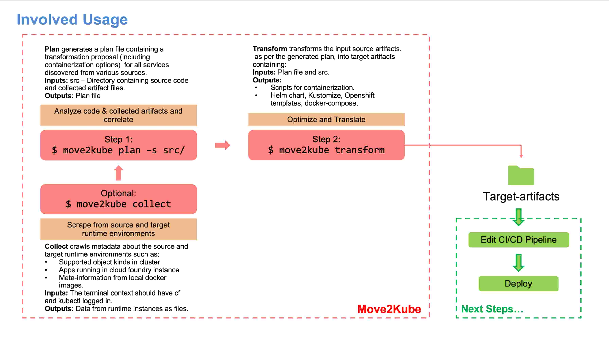

# Konveyor Move2Kube

## What is Move2Kube?

A tool that accelerates the process of re-platforming to Kubernetes by analyzing source files.


Move2Kube is a tool that uses source files such as Docker Compose files or Cloud Foundry manifest files, and even source code, to generate Kubernetes deployment files including object yaml, Helm charts, and operators.

## A quick start with Move2Kube

With Move2Kube, generating the Kubernetes/OpenShift deployment files for your source platform files is now simple. You can try out Move2Kube in [Katacoda](https://www.katacoda.com/move2kube) or follow the steps mentioned below for trying out Move2Kube on your local machine.


1. Install Move2Kube
   ```console
   $ bash <(curl https://raw.githubusercontent.com/konveyor/move2kube/main/scripts/install.sh)
   ```

1. Use our sample [docker-compose.yaml](https://raw.githubusercontent.com/konveyor/move2kube-demos/main/samples/docker-compose/single-service/docker-compose.yaml) file or your own

   ```console
   $ wget -P samples/docker-compose/ https://raw.githubusercontent.com/konveyor/move2kube-demos/main/samples/docker-compose/single-service/docker-compose.yaml
   $ cd samples
   $ move2kube transform -s docker-compose
   ```
1. Answer the questions and you will get the yaml files required for deploying the Docker Compose files in Kubernetes inside the `myproject` directory.

<p align="center">
<asciinema-player src="{{ site.baseurl }}/assets/asciinema//docker-compose-transformation.cast" poster="npt:0:13" rows=20 cols=88 title="Transforming different languages to run on Kubernetes"></asciinema-player>
</p>

## Usage

> A major use case is [Migrating Enterprise Scale Cloud Foundry Apps to Kubernetes](/tutorials/migration-workflow)

Move2Kube takes as input the source files and outputs the target deployment files.  




For more detailed information :
* [Installation](/installation)
* [Tutorials](/tutorials)
* [Documentation](/documentation)

## Discussion

To discuss with the maintainers, reach out in [slack](https://kubernetes.slack.com/archives/CR85S82A2) in [kubernetes](https://slack.k8s.io/) workspace or reach out to us in the [forum](https://groups.google.com/g/move2kube-dev).
